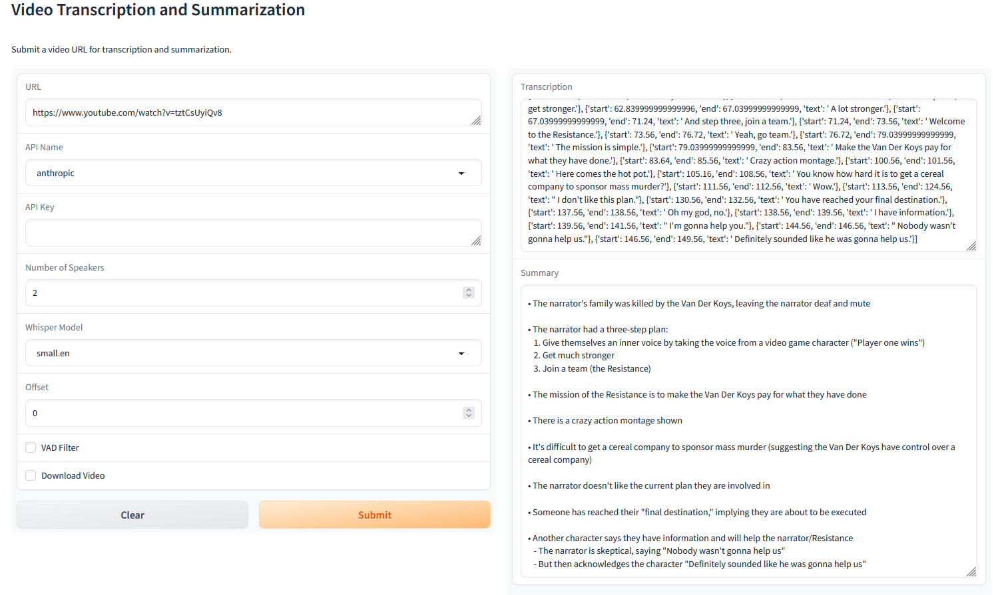

# [**TL/DW: Too Long, Didnt Watch - Download, Transcribe & Summarize Videos. All automated. (public instance link)**](https://hf.co/app)


### What is TL/DW?

Take a URL, single video, list of URLs, or list of local videos + URLs and feed it into the script and have each video transcribed (and audio downloaded if not local) using faster-whisper. Transcriptions can then be shuffled off to an LLM API endpoint of your choice, whether that be local or remote. Any site supported by yt-dl is supported, so you can use this with sites besides just youtube. ( https://github.com/yt-dlp/yt-dlp/blob/master/supportedsites.md )

I personally recommend Sonnet. It's great quality and relatively inexpensive. 
To be clear, Microsoft Phi-3 Mini 128k is great if you don't have a lot of VRAM and want to self-host. (I think it's better than anything up to 70B for summarization...)

### Application Demo
CLI


GUI


----------

### Table of Contents
- [What?](#what)
- [Using](#using)
- [Setup](#setup)
- [Pieces/What's in the Repo](#what)
- [Setting up a Local LLM Inference Engine](#localllm)
- [Credits](#credits)


### Quickstart after Installation
- **Download Audio only from URL -> Transcribe audio:**
  * `python summarize.py https://www.youtube.com/watch?v=4nd1CDZP21s`
- **Download Audio+Video from URL -> Transcribe audio from Video:**
  * `python summarize.py -v https://www.youtube.com/watch?v=4nd1CDZP21s`
- **Download Audio only from URL -> Transcribe audio -> Summarize using (`anthropic`/`cohere`/`openai`/`llama` (llama.cpp)/`ooba` (oobabooga/text-gen-webui)/`kobold` (kobold.cpp)/`tabby` (Tabbyapi)) API:**
  * `python summarize.py -v https://www.youtube.com/watch?v=4nd1CDZP21s -api <your choice of API>`
- **Download Audio+Video from a list of videos in a text file (can be file paths or URLs) and have them all summarized:**
  * `python summarize.py ./local/file_on_your/system --api_name <API_name>`


### <a name="what"></a>What?
- **Use the script to (download->)transcribe(->summarize) a local file or remote url.**
- **What can you transcribe and summarize?**
  * **Any youtube video.** Or video hosted at any of these sites: https://github.com/yt-dlp/yt-dlp/blob/master/supportedsites.md
    * (Playlists you have to use the `Get_Playlist_URLs.py` with `Get_Playlist_URLs.py <Playlist URL>` and it'll create a text file with all the URLs for each video, so you can pass the text file as input and they'll all be downloaded. Pull requests are welcome.)
    * Any url youtube-dl supports _should_ work.
  * **Local Videos**
    * Pass in the filepath to any local video file, and it will be transcribed.
    * You can also pass in a text file containing a list of videos for batch processing.
- **How does it Summarize?**
  - **Remote Summarization**
    * Pass an API name (anthropic/cohere/grok/openai/) as an argument, ex: `-api anthropic`
    * Add your API key to the `config.txt` file
    * The script when ran, will detect that you passed an API name, and will perform summarization of the resulting transcription.
  - **Local Summarization**
    * Alternatively, you can pass `llama`/`ooba`/`kobold`/`tabby` as the API name and have the script perform a request to your local API endpoint for summarization. 
      * You will need to modify the `<endpoint_name>_api_IP` value in the `config.txt` to reflect the `IP:Port` of your local server.
      * Or pass the `--api_url` argument with the `IP:Port` to avoid making changes to the `config.txt` file.
      * If the self-hosted server requires an API key, modify the appropriate api_key variable in the `config.txt` file.
  * The current approach to summarization is currently 'dumb'/naive, and will likely be replaced or additional functionality added to reflect actual practices and not just 'dump txt in and get an answer' approach. This works for big context LLMs, but not everyone has access to them, and some transcriptions may be even longer, so we need to have an approach that can handle those cases.
- **APIs Currently Supported**
  1. Anthropic
  2. Cohere
  3. Groq
  4. Llama.cpp
  5. Kobold.cpp
  6. Oobabooga
  7. HuggingFace
- **Planned to Support**
  1. TabbyAPI

----------

### <a name="setup"></a>Setup
- **Linux**
    1. Download necessary packages (Python3, ffmpeg[sudo apt install ffmpeg / dnf install ffmpeg], ?)
    2. Create a virtual env: `python -m venv ./`
    3. Launch/activate your virtual env: `. .\scripts\activate.sh`
    4. See `Linux && Windows`
- **Windows**
    1. Download necessary packages (Python3, [ffmpeg](https://www.gyan.dev/ffmpeg/builds/), ?)
    2. Create a virtual env: `python -m venv .\`
    3. Launch/activate your virtual env: `. .\scripts\activate.ps1`
    4. See `Linux && Windows`
- **Linux && Windows**
    1. `pip install -r requirements.txt` - may take a bit of time...
    2. Run `python ./summarize.py <video_url>` - The video URL does _not_ have to be a youtube URL. It can be any site that ytdl supports.
    3. You'll then be asked if you'd like to run the transcription through GPU(1) or CPU(2).
    4. Next, the video will be downloaded to the local directory by ytdl.
    5. Then the video will be transcribed by faster_whisper. (You can see this in the console output)
      * The resulting transcription output will be stored as both a json file with timestamps, as well as a txt file with no timestamps.
    6. Finally, you can have the transcription summarized through feeding it into an LLM of your choice.
    7. For running it locally, here's the commands to do so:
      * FIXME
    8. For feeding the transcriptions to the API of your choice, simply use the corresponding script for your API provider.
      * FIXME: add scripts for OpenAI api (generic) and others


### <a name="using"></a>Using
- Single file (remote URL) transcription
  * Single URL: `python summarize.py https://example.com/video.mp4`
- Single file (local) transcription)
  * Transcribe a local file: `python summarize.py /path/to/your/localfile.mp4`
- Multiple files (local & remote)
  * List of Files(can be URLs and local files mixed): `python summarize.py ./path/to/your/text_file.txt"`


Save time and use the `config.txt` file, it allows you to set these settings and have them used when ran.
```
usage: summarize.py [-h] [--api_name API_NAME] [--api_key API_KEY] [--num_speakers NUM_SPEAKERS] [--whisper_model WHISPER_MODEL] [--offset OFFSET]
                  [--vad_filter] [--log_level {DEBUG,INFO,WARNING,ERROR,CRITICAL}]
                  [input_path]

Transcribe and summarize videos.

positional arguments:
  input_path            Path or URL of the video

options:
  -h, --help            show this help message and exit
  -v, --video           Download the video instead of just the audio
  -api API_NAME, --api_name API_NAME
                        API name for summarization (optional)
  -key API_KEY, --api_key API_KEY
                        API key for summarization (optional)
  -ns NUM_SPEAKERS, --num_speakers NUM_SPEAKERS
                        Number of speakers (default: 2)
  -wm WHISPER_MODEL, --whisper_model WHISPER_MODEL
                        Whisper model (default: small.en)
  -off OFFSET, --offset OFFSET
                        Offset in seconds (default: 0)
  -vad, --vad_filter    Enable VAD filter
  -log {DEBUG,INFO,WARNING,ERROR,CRITICAL}, --log_level {DEBUG,INFO,WARNING,ERROR,CRITICAL}
                        Log level (default: INFO)
  -ui, --user_interface
                        Launch the Gradio user interface
  -demo, --demo_mode    Enable demo mode


-Download Audio only from URL -> Transcribe audio:
>python summarize.py https://www.youtube.com/watch?v=4nd1CDZP21s

-Download Audio only from URL -> Transcribe audio -> Summarize using (`anthropic`/`cohere`/`openai`/`llama` i.e. llama.cpp/`ooba`/`kobold`/`tabby`) API:
>python summarize.py https://www.youtube.com/watch?v=4nd1CDZP21s -api <your choice of API>

-Download Audio+Video from URL -> Transcribe audio from Video:
>python summarize.py --video https://www.youtube.com/watch?v=4nd1CDZP21s

-Download Audio+Video from a list of videos in a text file (can be file paths or URLs) and have them all summarized:
>python summarize.py --video ./local/file_on_your/system --api_name <API_name>

By default videos, transcriptions and summaries are stored in a folder with the video's name under './Results', unless otherwise specified in the config file.
```


------------

### <a name="localllm"></a>Setting up a Local LLM Inference Engine
- **Setting up Local LLM Runner**
  - **Llama.cpp**
    - **Linux & Mac**
      1. `git clone https://github.com/ggerganov/llama.cpp`
      2. `make` in the `llama.cpp` folder 
      3. `./server -m ../path/to/model -c <context_size>`
    - **Windows**
      1. `git clone https://github.com/ggerganov/llama.cpp`
      2. Download + Run: https://github.com/skeeto/w64devkit/releases
      3. cd to `llama.cpp` folder make` in the `llama.cpp` folder
      4. `server.exe -m ..\path\to\model -c <context_size>`
  - **Kobold.cpp** - c/p'd from: https://github.com/LostRuins/koboldcpp/wiki
    - **Windows**
      1. Download from here: https://github.com/LostRuins/koboldcpp/releases/latest
      2. `Double click KoboldCPP.exe and select model OR run "KoboldCPP.exe --help" in CMD prompt to get command line arguments for more control.`
      3. `Generally you don't have to change much besides the Presets and GPU Layers. Run with CuBLAS or CLBlast for GPU acceleration.`
      4. `Select your GGUF or GGML model you downloaded earlier, and connect to the displayed URL once it finishes loading.`
    - **Linux**
      1. `On Linux, we provide a koboldcpp-linux-x64 PyInstaller prebuilt binary on the releases page for modern systems. Simply download and run the binary.`
        * Alternatively, you can also install koboldcpp to the current directory by running the following terminal command: `curl -fLo koboldcpp https://github.com/LostRuins/koboldcpp/releases/latest/download/koboldcpp-linux-x64 && chmod +x koboldcpp`
      2. When you can't use the precompiled binary directly, we provide an automated build script which uses conda to obtain all dependencies, and generates (from source) a ready-to-use a pyinstaller binary for linux users. Simply execute the build script with `./koboldcpp.sh dist` and run the generated binary.
  - **oobabooga - text-generation-webui** - https://github.com/oobabooga/text-generation-webui
    1. Clone or download the repository.
      * Clone: `git clone https://github.com/oobabooga/text-generation-webui`
      * Download: https://github.com/oobabooga/text-generation-webui/releases/latest -> Download the `Soruce code (zip)` file -> Extract -> Continue below.
    2. Run the `start_linux.sh`, `start_windows.bat`, `start_macos.sh`, or `start_wsl.bat` script depending on your OS.
    3. Select your GPU vendor when asked.
    4. Once the installation ends, browse to http://localhost:7860/?__theme=dark.
  - **Exvllama2**
- **Setting up a Local LLM Model**
  1. microsoft/Phi-3-mini-128k-instruct - 3.8B Model/7GB base, 4GB Q8 - https://huggingface.co/microsoft/Phi-3-mini-128k-instruct
    * GGUF Quants: https://huggingface.co/pjh64/Phi-3-mini-128K-Instruct.gguf
  2. Meta Llama3-8B - 8B Model/16GB base, 8.5GB Q8  - https://huggingface.co/meta-llama/Meta-Llama-3-8B-Instruct
    * GGUF Quants: https://huggingface.co/lmstudio-community/Meta-Llama-3-8B-Instruct-GGUF


----------


### <a name="pieces"></a>Pieces & What's in the repo?
- **Workflow**
  1. Setup python + packages
  2. Setup ffmpeg
  3. Run `python summarize.py <video_url>` or `python summarize.py <List_of_videos.txt>`
  4. If you want summarization, add your API keys (if not using a local LLM) to the `config.txt` file, and then re-run the script, passing in the name of the API [or URL endpoint - to be added] to the script.
    * `python summarize.py https://www.youtube.com/watch?v=4nd1CDZP21s --api_name anthropic` - This will attempt to download the video, then upload the resulting json file to the anthropic API endpoint, referring to values set in the config file (API key and model) to request summarization.
    - Anthropic:
      * `claude-3-opus-20240229`
      * `claude-3-sonnet-20240229`
      * `claude-3-haiku-20240307`
    - Cohere: 
      * `command-r`
      * `command-r-plus`
    - Groq
      * `llama3-8b-8192`
      * `llama3-70b-8192`
      * `mixtral-8x7b-32768`
    - HuggingFace:
      * `CohereForAI/c4ai-command-r-plus`
      * `meta-llama/Meta-Llama-3-70B-Instruct`
      * `meta-llama/Meta-Llama-3-8B-Instruct`
      * Supposedly you can use any model on there, but this is for reference for the free demo instance, in case you'd like to host your own.
    - OpenAI:
      * `gpt-4-turbo`
      * `gpt-4-turbo-preview`
      * `gpt-4`
- **What's in the repo?**
  - `summarize.py` - download, transcribe and summarize audio
    1. First uses [yt-dlp](https://github.com/yt-dlp/yt-dlp) to download audio(optionally video) from supplied URL
    2. Next, it uses [ffmpeg](https://github.com/FFmpeg/FFmpeg) to convert the resulting `.m4a` file to `.wav`
    3. Then it uses [faster_whisper](https://github.com/SYSTRAN/faster-whisper) to transcribe the `.wav` file to `.txt`
    4. After that, it uses [pyannote](https://github.com/pyannote/pyannote-audio) to perform 'diarorization'
    5. Finally, it'll send the resulting txt to an LLM endpoint of your choice for summarization of the text.
  - `chunker.py` - break text into parts and prepare each part for LLM summarization
  - `roller-*.py` - rolling summarization
    - [can-ai-code](https://github.com/the-crypt-keeper/can-ai-code) - interview executors to run LLM inference
  - `compare.py` - prepare LLM outputs for webapp
  - `compare-app.py` - summary viewer webapp


------------

### <a name="credits"></a>Credits
- [original](https://github.com/the-crypt-keeper/tldw)
- [yt-dlp](https://github.com/yt-dlp/yt-dlp)
- [ffmpeg](https://github.com/FFmpeg/FFmpeg)
- [faster_whisper](https://github.com/SYSTRAN/faster-whisper)
- [pyannote](https://github.com/pyannote/pyannote-audio)