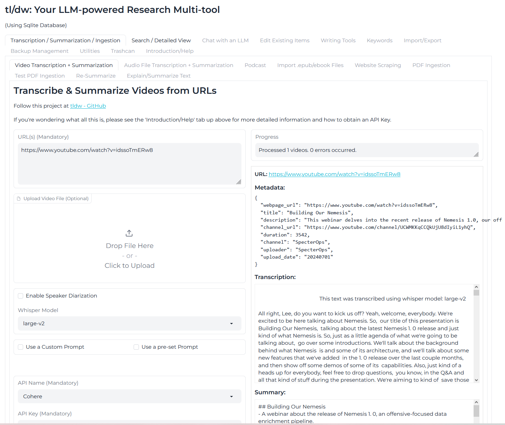

# **tl/dw: Too Long, Didnt Watch** 
## Download, Transcribe, Summarize & Chat with Video+Audio+Documents+Articles & Books. 
### All automated. All local. All yours.
## [Public Demo](https://huggingface.co/spaces/oceansweep/Vid-Summarizer) 
#### More: Full-Text-Search across everything ingested (RAG is wip), Local LLM inference as part of it(llamafile) for those who don't want to mess with setting up an LLM, and a WebApp(gradio as PoC) to interact with the script in a more user-friendly manner.
#### The original scripts by `the-crypt-keeper` are available here: [scripts here](https://github.com/the-crypt-keeper/tldw/tree/main/tldw-original-scripts)


**Use the Installer Script! Download and run it to install the necessary packages + launch tl/dw**
- **Linux:** `wget https://raw.githubusercontent.com/rmusser01/tldw/main/Helper_Scripts/Installer_Scripts/Linux_Install_Update.sh && wget https://raw.githubusercontent.com/rmusser01/tldw/main/Helper_Scripts/Installer_Scripts/Linux_Run_tldw.sh`
  - `chmod +x Linux_Install_Update.sh && ./Linux_Run_tldw.sh`
- **MacOS:** `wget https://raw.githubusercontent.com/rmusser01/tldw/main/Helper_Scripts/Installer_Scripts/MacOS-Run-Install-Update.sh`
  - `bash MacOS-Run-Install-Update.sh`
- **Windows:** `wget https://raw.githubusercontent.com/rmusser01/tldw/main/Helper_Scripts/Installer_Scripts/Windows_Install_Update.bat && wget wget https://raw.githubusercontent.com/rmusser01/tldw/main/Helper_Scripts/Installer_Scripts/Windows_Run_tldw.bat`
    - Then double-click the downloaded batch file `Windows_Install_Update.bat` to install it, and `Windows_Run_tldw.bat` to run it.
----------

### Table of Contents
- [What?](#what) | [Quickstart](#quickstart) | [Setup](#setup) | [Using tldw](#using) | [What's in the Repo / Pieces](#whatbox) | [Helpful Terms and Things to Know](#helpful) | [Setting up a Local LLM Inference Engine](#localllm) | [Credits](#credits) | [Roadmap Plans](#plans) | 

----------
**GUI Screenshot**



### <a name="what"></a> What is this (TL/DW)?
- **What it is now:**
  - A tool that can ingest: audio, videos, articles, free form text, documents, and books as text into a personal, offline database, so that you can then search and chat with it at any time on your own device/locally.
    - (+ act as a nice way of creating your personal 'media' database, a personal digital library with search!)
  - And of course, this is all open-source/free, with the idea being that this can massively help people in their efforts of research and learning.
    - I don't plan to pivot and turn this into a commercial project. I do plan to make a server version of it, with the potential for offering a hosted version of it, but that's a ways off, and I don't see it as more worthwhile than some other endeavors.
    - If anything, I'd like to see this project be used in schools, universities, and research institutions, or anyone who wants to keep a record of what they've consumed and be able to search and ask questions about it.
    - I believe that this project can be a great tool for learning and research, and I'd like to see it develop to a point where it could be reasonably used as such.
    - In the meantime, if you don't care about data ownership or privacy, https://notebooklm.google/ is a good alternative that works, is free, and has a working RAG setup (unlike mine :cry:).
  - **Current features:** 
    - **Ingest content(Video/Audio/epub/PDF/txt/websites) from a URL(single or multiple at once) or a local file(drag+drop).**
    - **Transcription of Video/Audio content using faster_whisper, with the ability to select the model to use.**
      - Any site supported by yt-dl is supported, so you can use this with sites besides just youtube. 
      - **List of supported sites:** https://github.com/yt-dlp/yt-dlp/blob/master/supportedsites.md
    - **Automatic summarization of content using an LLM API endpoint of your choice. A default prompt is used but you can set your own.**
      - Various chunking options for summarization, as well as the ability to chain summaries together.
      - Ability to download the generated transcript, and summary as text files from the UI.
      - Ability to download the video/audio as files from the UI.
      - Can also _just_ download the video/audio from a URL. (Utilities tab)
    - **Storage of all the above into a SQLite DB, with search(name/content/author/URL/keyword), tagging, and export functionality.**
    - **Search across all the content you've ingested, and review or modify it using SQLite FTS5 Search.**
      - Ability to tag content with keywords, and search across those tags.
    - **Chat with an LLM about the content you've ingested, or ask questions about it. (Multiple APIs Supported, 15 total)**
      - **APIs Supported:** 
        - **Commercial:** OpenAI / Anthropic / Cohere / DeepSeek / Groq / Mistral / OpenRouter / HuggingFace; 
        - **Local:** Llama.cpp / Kobold.cpp / Oobabooga / TabbyAPI / vLLM / Ollama / ;
    - **Prompt storage and retrieval, as well as the ability to select prompts from the DB to use with your questions.**
    - **General Chat front-end**
      - Regular chat UI;
      - 'Stacked' Chat UI;
      - One prompt, multiple responses UI;
      - Four independent prompts/conversations UI;
      - Local LLM inference as part of it(llamafile) for those who don't want to mess with setting up an LLM.
      - Chat management, with the ability to save, delete, edit, search and export chats. (WIP)
      - Chat 'Workflows' - A way to string together multiple questions and responses into a single chat. (WIP)
      - Chat 'Sessions' - A way to save a chat and come back to it later.
      - Support for SillyTavern character cards, and the ability to store/select from them in the chat UI. (saves as a JSON file, not to the SQLite DB)
    - **Ability to edit any of the content you've ingested, as well as the ability to delete it. (Including prompts)**
    - **Writing Tools**
      - Writing Feedback - A way to get feedback on your writing from an LLM, impersonating a variety of different authors.
      - Grammar and Style checking - A way to check your writing for grammar and style issues.
      - Tone analyzer + Editor - A way to check and modify the tone or style of your writing.
      - Writing Prompts - A way to get writing prompts from an LLM from a desired author.
    - **Import Functionality:**
      - Existing Markdown/text files into the DB, with the ability to set the title, author, and tags for the content.
      - List of URLs(web scraping), and ingest them all at once.
      - List of local files(video/audio) from a text file, and ingest them all at once.
      - Obsidian Vaults into the DB. (Imported notes are automatically parsed for tags and titles)
      - Prompts.
        - Single or multiple at once, in a zip file.
    - **Export functionality for all content, as well as the ability to export the entire DB(It's SQLite...).**
    - **Backup Management - A way to back up the DB, view backups, and restore from a backup. (WIP)**
    - **'Trashcan' Support - A way to 'soft' delete content, and restore it if needed. (Helps with accidental deletions)**
    - **Ability to set various configurations via the `config.txt` file.**
- **Where its headed:**
  - Act as a Multi-Purpose Research tool. The idea being that there is so much data one comes across, and we can store it all as text. (with tagging!)
  - Imagine, if you were able to keep a copy of every talk, research paper or article you've ever read, and have it at your fingertips at a moments notice.
  - Now, imagine if you could ask questions about that data/information(LLM), and be able to string it together with other pieces of data, to try and create sense of it all (RAG)
  - Basically a [cheap foreign knockoff](https://tvtropes.org/pmwiki/pmwiki.php/Main/ShoddyKnockoffProduct) [`Young Lady's Illustrated Primer`](https://en.wikipedia.org/wiki/The_Diamond_Age) that you'd buy from some [shady dude in a van at a swap meet](https://tvtropes.org/pmwiki/pmwiki.php/Main/TheLittleShopThatWasntThereYesterday).
    * Some food for thought: https://notes.andymatuschak.org/z9R3ho4NmDFScAohj3J8J3Y
    * I say this recognizing the inherent difficulties in replicating such a device and acknowledging the current limitations of technology.
  - This is a free-time project, so I'm not going to be able to work on it all the time, but I do have some ideas for where I'd like to take it.
    - I view this as a personal tool I'll ideally continue to use for some time until something better/more suited to my needs comes along.
    - Until then, I plan to continue working on this project and improving as much as possible.
    - If I can't get a "Young Lady's Illustrated Primer" in the immediate, I'll just have to hack together some poor imitation of one....
  - **Planned Features**
    - Firstly, you can check all planned features on the issues page: https://github.com/rmusser01/tldw/issues
    - Anything I come up with or hear about will either just be dropped in, or an issue will be created and then implemented.
    - I plan to add the following in the future in no particular order:
      - RAG - Retrieval-Augmented Generation support. Do not want to use any existing libraries. Would prefer to do it all from scratch. 
      - More API support - I want to add support for more APIs, and I want to make it easier to select between private/Public endpoints in the UI
      - Completely new UI - I want to make the UI more user-friendly and more intuitive. 
        - Gradio is great as PoC, but I think I've shown that this has value and is worth the continued effort.
      - Add support for 'streaming' answers, so it feels more 'real-time'
      - Add TTS/STT support for the UI so you can ask questions directly to the model or have it speak out the results to you.
        - Having something like this would be pretty fucking cool I think: https://github.com/smellslikeml/dolla_llama/tree/main (Need to look more into nemesis by specterops)
      - Add some neat writing tools, since why not have some fun?
        - https://github.com/the-crypt-keeper/the-muse 
        - https://github.com/the-crypt-keeper/LLooM 
        - https://github.com/lmg-anon/mikupad 
        - https://github.com/datacrystals/AIStoryWriter
      - Evaluations for Summarization process
        - Setup eval for user-ran testing
        - Do some prompt engineering
      - Evaluations for whisper transcription accuracy
        - Identify accuracy of used models.
        - Set it up so users can test against their own datasets
      - Offline diarization of speakers - Code is in, but there was some issue that was a headache so I said screw it.
        - Should work if you give it an HF api key in the code though...
- **Don't care, give me code**
   - **Linux:** `wget https://raw.githubusercontent.com/rmusser01/tldw/main/Helper_Scripts/Installer_Scripts/Linux-Install.sh`
   - **Windows:** `wget https://raw.githubusercontent.com/rmusser01/tldw/main/Helper_Scripts/Installer_Scripts/Windows_Install_Update.bat && wget wget https://raw.githubusercontent.com/rmusser01/tldw/main/Helper_Scripts/Installer_Scripts/Windows_Run_tldw.bat`
   - **MacOS:** `wget https://raw.githubusercontent.com/rmusser01/tldw/main/Helper_Scripts/Installer_Scripts/MacOS_Install_Update.sh && wget https://raw.githubusercontent.com/rmusser01/tldw/main/Helper_Scripts/Installer_Scripts/MacOS_Run_tldw.sh`
   - GUI usage: `python summarize.py -gui`
   - GUI with local LLM: `python summarize.py -gui --local_llm` (will ask you questions about which model to download and whether to use CPU/GPU)


For commercial API usage for use with this project: Claude Sonnet 3.5, Cohere Command R+, DeepSeek. Flipside I would say none honestly. The (largest players) will gaslight you and charge you money for it. Fun.
From @nrose 05/08/2024 on Threads:
```
No, it’s a design. First they train it, then they optimize it. Optimize it for what- better answers?
  No. For efficiency. 
Per watt. Because they need all the compute they can get to train the next model.So it’s a sawtooth. 
The model declines over time, then the optimization makes it somewhat better, then in a sort of 
  reverse asymptote, they dedicate all their “good compute” to the next bigger model.Which they then 
  trim down over time, so they can train the next big model… etc etc.
None of these companies exist to provide AI services in 2024. They’re only doing it to finance the 
 things they want to build in 2025 and 2026 and so on, and the goal is to obsolete computing in general
  and become a hidden monopoly like the oil and electric companies. 
2024 service quality is not a metric they want to optimize, they’re forced to, only to maintain some 
  directional income
```

----------

### <a name="quickstart">Quickstart</a>

#### Automatic Quickstart
1. **Download the Installer Script for your OS:**
   - **Linux:** `wget https://raw.githubusercontent.com/rmusser01/tldw/main/Helper_Scripts/Installer_Scripts/Linux_Install_Update.sh && wget https://raw.githubusercontent.com/rmusser01/tldw/main/Helper_Scripts/Installer_Scripts/Linux_Run_tldw.sh`
   - **Windows:** `wget https://raw.githubusercontent.com/rmusser01/tldw/main/Helper_Scripts/Installer_Scripts/Windows_Install_Update.bat && wget wget https://raw.githubusercontent.com/rmusser01/tldw/main/Helper_Scripts/Installer_Scripts/Windows_Run_tldw.bat`
   - **MacOS:** `wget https://raw.githubusercontent.com/rmusser01/tldw/main/Helper_Scripts/Installer_Scripts/MacOS_Install_Update.sh && wget https://raw.githubusercontent.com/rmusser01/tldw/main/Helper_Scripts/Installer_Scripts/MacOS_Run_tldw.sh`
2. **Run the Installer Script:**
   - **Linux:** 
     - `chmod +x Linux_Install_Update.sh && chmod +x ./Linux_Run_tldw.sh`
     - `./Linux_Install_Update.sh`
     - This will install tldw to the directory from where the script is ran.
   - **Windows:** `Windows_Install_Update.bat`
     - Double-click the downloaded batch file to install it.
     - This will install tldw to the directory from where the script is ran.
   - **MacOS:** `bash MacOS-Install_Updater.sh`
     - `chmod +x MacOS_Install_Update.sh && chmod +x ./MacOS_Run_tldw.sh`
     - `./MacOS_Install_Update.sh && ./MacOS_Run_tldw.sh`
     - This will install tldw to the directory from where the script is ran.
3. **Follow the prompts to install the necessary packages and setup the program.**
4. **You are Ready to Go! You should see tldw start up at the end of the script, assuming everything worked as expected**
5. **BE SURE TO UPDATE 'config.txt' WITH YOUR API KEYS AND SETTINGS!** - You need to do this unless you want to manually input your API keys everytime you interact with a commercial LLM...

- **Run it as a WebApp**
  * `python summarize.py -gui` - This requires you to either stuff your API keys into the `config.txt` file, or pass them into the app every time you want to use it.
    * It exposes every CLI option, and has a nice toggle to make it 'simple' vs 'Advanced'
    * Has an option to download the generated transcript, and summary as text files from the UI.
    * Can also download video/audio as files if selected in the UI (WIP - doesn't currently work)
    - Gives you access to the whole SQLite DB backing it, with search, tagging, and export functionality
      * Yes, that's right. Everything you ingest, transcribe and summarize is tracked through a local(!) SQLite DB.
      * So everything you might consume during your path of research, tracked and assimilated and tagged.
      * All into a shareable, single-file DB that is open source and extremely well documented. (The DB format, not this project :P) 

#### Command Line usage:
- **Transcribe audio from a Youtube URL:**
  * `python summarize.py https://www.youtube.com/watch?v=4nd1CDZP21s`

- **Transcribe audio from a Youtube URL & Summarize it using (`anthropic`/`cohere`/`openai`/`llama` (llama.cpp)/`ooba` (oobabooga/text-gen-webui)/`kobold` (kobold.cpp)/`tabby` (Tabbyapi)) API:**
  * `python summarize.py https://www.youtube.com/watch?v=4nd1CDZP21s -api <your choice of API>`
    - Make sure to put your API key into `config.txt` under the appropriate API variable

- **Transcribe a list of Youtube URLs & Summarize them using (`anthropic`/`cohere`/`openai`/`llama` (llama.cpp)/`ooba` (oobabooga/text-gen-webui)/`kobold` (kobold.cpp)/`tabby` (Tabbyapi)) API:**
  * `python summarize.py ./ListofVideos.txt -api <your choice of API>`
    - Make sure to put your API key into `config.txt` under the appropriate API variable

- **Transcribe & Summarize a List of Videos on your local filesytem with a text file:**
  * `python summarize.py -v ./local/file_on_your/system`

- **Download a Video with Audio from a URL:**
  * `python summarize.py -v https://www.youtube.com/watch?v=4nd1CDZP21s`s

- **Perform a summarization of a longer transcript using 'Chunking'**
  * `python summarize.py -roll -detail 0.01 https://www.youtube.com/watch?v=4nd1CDZP21s`
    * Detail can go from `0.01` to `1.00`, increments at a measure of `.01`.

- **Convert an epub book to text and ingest it into the DB**
  1. Download/Install pandoc for your platform:
    * https://pandoc.org/installing.html
  2. Convert your epub to a text file:
     * `$ pandoc -f epub -t plain -o filename.txt filename.epub`
  3. Ingest your converted epub into the DB:
     * `python summarize.py path/to/your/textfile.txt --ingest_text_file --text_title "Book Title" --text_author "Author Name" -k additional,keywords`

----------
### <a name="setup"></a>Setting it up Manually
- **Requirements**
  - Python3
  - ffmpeg
  - pandoc (for epub to markdown conversion) - https://pandoc.org/installing.html
    - `pandoc -f epub -t markdown -o output.md input.epub` -> Can then import/ingest the markdown file into the DB.
    - If done from the CLI using the `--ingest_text_file` flag, you can specify the title and author of the book, as well as any additional keywords you'd like to tag it with. (if not a regex will attempt to identify it)
    - Or just do it through the GUI, drag and drop the file into the UI, set the Title, Author, and any keywords and hit `Import Data`.
  - GPU Drivers/CUDA drivers or CPU-only PyTorch installation for ML processing
    - Apparently there is a ROCm version of PyTorch.
      - MS Pytorch: https://learn.microsoft.com/en-us/windows/ai/directml/pytorch-windows -> `pip install torch-directml`
      - Use the 'AMD_requests.txt' file to install the necessary packages for AMD GPU support. Simply rename it before use.
      - AMD Pytorch: https://rocm.docs.amd.com/projects/radeon/en/latest/docs/install/wsl/install-pytorch.html
  - API keys for the LLMs you want to use (or use the local LLM option/Self-hosted)
  - System RAM (8GB minimum, realistically 12GB)
  - Disk Space (Depends on how much you ingest, but 6GB or so should be fine for the total size of the project + DB)
    - This can balloon real quick. The whisper model used for transcription can be 1-2GB per.
    - Pytorch + other ML libraries will also cause the size to increase.
    - As such, I would say you want at least 8GB of free space on your system to devote to the app.
    - Text content itself is tiny, but the supporting libraries + ML models can be quite large.
- **Linux**
    1. Download necessary packages (Python3, ffmpeg - `sudo apt install ffmpeg` or `dnf install ffmpeg`, Update your GPU Drivers/CUDA drivers if you'll be running an LLM locally)
    2. Open a terminal, navigate to the directory you want to install the script in, and run the following commands:
    3. `git clone https://github.com/rmusser01/tldw`
    4. `cd tldw`
    5. Create a virtual env: `sudo python3 -m venv ./`
    6. Launch/activate your virtual environment: `source ./bin/activate`
    7. Setup the necessary python packages:
       * Following is from: https://docs.nvidia.com/deeplearning/cudnn/latest/installation/linux.html
       * If you don't already have cuda installed, `py -m pip install --upgrade pip wheel` & `pip install torch==2.2.2 torchvision==0.17.2 torchaudio==2.2.2 --index-url https://download.pytorch.org/whl/cu118` 
       * Or CPU Only: `pip install torch==2.2.2 torchvision==0.17.2 torchaudio==2.2.2 --index-url https://download.pytorch.org/whl/cpu`
         * Also be sure to change `cuda` to `cpu` in `config.txt`
       * https://pytorch.org/get-started/previous-versions/#linux-and-windows-3
    8. Then see `Linux && Windows`
- **MacOS**
    1. I don't own a mac/have access to one reliably so I can't test this, but it should be the same as/similar to Linux.
- **Windows**
    1. Download necessary packages ([Python3](https://www.python.org/downloads/windows/), Update your GPU drivers/CUDA drivers if you'll be running an LLM locally, ffmpeg will be installed by the script)
    2. Open a terminal, navigate to the directory you want to install the script in, and run the following commands:
    3. `git clone https://github.com/rmusser01/tldw`
    4. `cd tldw`
    5. Create a virtual env: `python3 -m venv ./`
    6. Launch/activate your virtual env: PowerShell: `. .\scripts\activate.ps1` or for CMD: `.\scripts\activate.bat`
    7. Setup the necessary python packages:
       - Cuda
         * https://docs.nvidia.com/deeplearning/cudnn/latest/installation/windows.html
           * If you don't already have cuda installed, `py -m pip install --upgrade pip wheel` & `pip install torch==2.2.2 torchvision==0.17.2 torchaudio==2.2.2 --index-url https://download.pytorch.org/whl/cu118` 
       - CPU Only: `pip install torch==2.2.2 torchvision==0.17.2 torchaudio==2.2.2 --index-url https://download.pytorch.org/whl/cpu`
           * https://pytorch.org/get-started/previous-versions/#linux-and-windows-3
           * Also be sure to change `cuda` to `cpu` in `config.txt`
       - AMD
         * `pip install torch-directml`
    8. See `Linux && Windows`
- **Linux && Windows**
    1. `pip install -r requirements.txt` - may take a bit of time...
    2. **GUI Usage:**
         - Put your API keys and settings in the `config.txt` file.
           - This is where you'll put your API keys for the LLMs you want to use, as well as any other settings you want to have set by default. (Like the IP of your local LLM to use for summarization)
         - (make sure your in the python venv - Run `source ./bin/activate` or `.\scripts\activate.ps1` or `.\scripts\activate.bat` from the `tldw` directory)
         - Run `python ./summarize.py -gui` - This will launch a webapp that will allow you to interact with the script in a more user-friendly manner.
           * You can pass in the API keys for the LLMs you want to use in the `config.txt` file, or pass them in when you use the GUI.
           * You can also download the generated transcript and summary as text files from the UI.
           * You can also download the video/audio as files from the UI. (WIP - doesn't currently work)
           * You can also access the SQLite DB that backs the app, with search, tagging, and export functionality.
    3. **Local LLM with the Script Usage:**
       - (make sure your in the python venv - Run `source ./bin/activate` or `.\scripts\activate.ps1` or `.\scripts\activate.bat` from the `tldw` directory)
       - I recognize some people may like the functionality and idea of it all, but don't necessarily know/want to know about LLMs/getting them working, so you can also have the script download and run a local model, using system RAM and llamafile/llama.cpp.
       - Simply pass `--local_llm` to the script (`python summarize.py --local-llm`), and it'll ask you if you want to download a model, and which one you'd like to download.
       - Then, after downloading and selecting a model, it'll launch the model using llamafile, so you'll have a browser window/tab opened with a frontend to the model/llama.cpp server.
       - You'll also have the GUI open in another tab as well, a couple seconds after the model is launched, like normal.
       - You can then interact with both at the same time, being able to ask questions directly to the model, or have the model ingest output from the transcript/summary and use it to ask questions you don't necessarily care to have stored within the DB. (All transcripts, URLs processed, prompts used, and summaries generated, are stored in the DB, so you can always go back and review them or re-prompt with them)

- **Setting up Epub to Markdown conversion with Pandoc**
    - **Linux / MacOS / Windows**
        - Download and install from: https://pandoc.org/installing.html
- **Converting Epub to markdown**
    - `pandoc -f epub -t markdown -o output.md input.epub`
- **Setting up PDF to Markdown conversion with Marker** (Optional - Necessary to do PDF ingestion/conversion)
    - **Linux**
        1. `sudo apt install python3-venv`
        2. `python3 -m venv ./Helper_Scripts/marker_venv`
        3. `source ./Helper_Scripts/marker_venv/bin/activate`  
        4. `pip install marker`
    - **Windows**
        1. Install python3 from https://www.python.org/downloads/
        2. `python Helper_Scripts\marker_venv\Scripts\activate\activate.ps1`
        3. `pip install marker`
- **Converting PDF to markdown**
    - Convert a Single PDF to Markdown:
        * `marker_single /path/to/file.pdf /path/to/output/folder --batch_multiplier 2 --langs English`
    - Convert a Folder of PDFs to Markdown:
        * `marker /path/to/folder/with/pdfs /path/to/output/folder --batch_multiplier 2 --langs English`
- **Ingest Converted text files en-masse**
    - `python summarize.py <path_to_text_file> --ingest_text_file --text_title "Title" --text_author "Author Name" -k additional,keywords`


----------
### <a name="using"></a>Using tldw
- Run the GUI and get access to all the features of the script(+ more) in a more user-friendly manner.
  * `python summarize.py -gui`
- Single file (remote URL) transcription
  * Single URL: `python summarize.py https://example.com/video.mp4`
- Single file (local) transcription)
  * Transcribe a local file: `python summarize.py /path/to/your/localfile.mp4`
- Multiple files (local & remote)
  * List of Files(can be URLs and local files mixed): `python summarize.py ./path/to/your/text_file.txt"`
- Download and run an LLM using only your system RAM! (Need at least 8GB Ram, realistically 12GB)
  * `python summarize.py -gui --local_llm`
- Save time and use the `config.txt` file, it allows you to set these settings and have them used when ran.
- **See `CLI_Reference.md` for a full list of CLI options and how to use them in the `Docs` folder**'
- Download Audio only from URL -> Transcribe audio:
  >python summarize.py https://www.youtube.com/watch?v=4nd1CDZP21s

- Transcribe audio from a Youtube URL & Summarize it using (anthropic/cohere/openai/llama (llama.cpp)/ooba (oobabooga/text-gen-webui)/kobold (kobold.cpp)/tabby (Tabbyapi)) API:
  >python summarize.py https://www.youtube.com/watch?v=4nd1CDZP21s -api <your choice of API>
    - Make sure to put your API key into `config.txt` under the appropriate API variable

- Download Video with audio from URL -> Transcribe audio from Video:
  >python summarize.py -v https://www.youtube.com/watch?v=4nd1CDZP21s

- Download Audio+Video from a list of videos in a text file (can be file paths or URLs) and have them all summarized:
  >python summarize.py --video ./local/file_on_your/system --api_name <API_name>

- Transcribe & Summarize a List of Videos on your local filesytem with a text file:
  >python summarize.py -v ./local/file_on_your/system

- Run it as a WebApp:
  >`python summarize.py -gui
  
------------

### <a name="helpful"></a> Helpful Terms and Things to Know
- Purpose of this section is to help bring awareness to certain concepts and terms that are used in the field of AI/ML/NLP, as well as to provide some resources for learning more about them.
- Also because some of those things are extremely relevant and important to know if you care about accuracy and the effectiveness of the LLMs you're using.
- Some of this stuff may be 101 level, but I'm going to include it anyways. This repo is aimed at people from a lot of different fields, so I want to make sure everyone can understand what's going on. Or at least has an idea.
- LLMs 101(coming from a tech background): https://vinija.ai/models/LLM/
- LLM Fundamentals / LLM Scientist / LLM Engineer courses(Free): https://github.com/mlabonne/llm-course
- **Phrases & Terms**
  - **LLM** - Large Language Model - A type of neural network that can generate human-like text.
  - **API** - Application Programming Interface - A set of rules and protocols that allows one software application to communicate with another.
  - **API Wrapper** - A set of functions that provide a simplified interface to a larger body of code.
  - **API Key** - A unique identifier that is used to authenticate a user, developer, or calling program to an API.
  - **GUI** - Graphical User Interface
  - **CLI** - Command Line Interface
  - **DB** - Database
  - **SQLite** - A C-language library that implements a small, fast, self-contained, high-reliability, full-featured, SQL database engine.
  - **Prompt Engineering** - The process of designing prompts that are used to guide the output of a language model.
  - **Quantization** - The process of converting a continuous range of values into a finite range of discrete values.
  - **GGUF Files** - GGUF is a binary format that is designed for fast loading and saving of models, and for ease of reading. Models are traditionally developed using PyTorch or another framework, and then converted to GGUF for use in GGML. https://github.com/ggerganov/ggml/blob/master/docs/gguf.md
  - **Inference Engine** - A software system that is designed to execute a model that has been trained by a machine learning algorithm. Llama.cpp and Kobold.cpp are examples of inference engines.
- **Papers & Concepts**
  1. Lost in the Middle: How Language Models Use Long Contexts(2023)
    - https://arxiv.org/abs/2307.03172 
    - `We analyze the performance of language models on two tasks that require identifying relevant information in their input contexts: multi-document question answering and key-value retrieval. We find that performance can degrade significantly when changing the position of relevant information, indicating that current language models do not robustly make use of information in long input contexts. In particular, we observe that performance is often highest when relevant information occurs at the beginning or end of the input context, and significantly degrades when models must access relevant information in the middle of long contexts, even for explicitly long-context models`
  2. [RULER: What's the Real Context Size of Your Long-Context Language Models?(2024)](https://arxiv.org/abs/2404.06654)
    - `The needle-in-a-haystack (NIAH) test, which examines the ability to retrieve a piece of information (the "needle") from long distractor texts (the "haystack"), has been widely adopted to evaluate long-context language models (LMs). However, this simple retrieval-based test is indicative of only a superficial form of long-context understanding. To provide a more comprehensive evaluation of long-context LMs, we create a new synthetic benchmark RULER with flexible configurations for customized sequence length and task complexity. RULER expands upon the vanilla NIAH test to encompass variations with diverse types and quantities of needles. Moreover, RULER introduces new task categories multi-hop tracing and aggregation to test behaviors beyond searching from context. We evaluate ten long-context LMs with 13 representative tasks in RULER. Despite achieving nearly perfect accuracy in the vanilla NIAH test, all models exhibit large performance drops as the context length increases. While these models all claim context sizes of 32K tokens or greater, only four models (GPT-4, Command-R, Yi-34B, and Mixtral) can maintain satisfactory performance at the length of 32K. Our analysis of Yi-34B, which supports context length of 200K, reveals large room for improvement as we increase input length and task complexity.`
  3. [Same Task, More Tokens: the Impact of Input Length on the Reasoning Performance of Large Language Models(2024)](https://arxiv.org/abs/2402.14848)
     - `Our findings show a notable degradation in LLMs' reasoning performance at much shorter input lengths than their technical maximum. We show that the degradation trend appears in every version of our dataset, although at different intensities. Additionally, our study reveals that the traditional metric of next word prediction correlates negatively with performance of LLMs' on our reasoning dataset. We analyse our results and identify failure modes that can serve as useful guides for future research, potentially informing strategies to address the limitations observed in LLMs.`
  4. Abliteration (Uncensoring LLMs)
     - [Uncensor any LLM with abliteration - Maxime Labonne(2024)](https://huggingface.co/blog/mlabonne/abliteration)
  5. Retrieval-Augmented-Generation
        - [Retrieval-Augmented Generation for Large Language Models: A Survey](https://arxiv.org/abs/2312.10997)
          - https://arxiv.org/abs/2312.10997
          - `Retrieval-Augmented Generation (RAG) has emerged as a promising solution by incorporating knowledge from external databases. This enhances the accuracy and credibility of the generation, particularly for knowledge-intensive tasks, and allows for continuous knowledge updates and integration of domain-specific information. RAG synergistically merges LLMs' intrinsic knowledge with the vast, dynamic repositories of external databases. This comprehensive review paper offers a detailed examination of the progression of RAG paradigms, encompassing the Naive RAG, the Advanced RAG, and the Modular RAG. It meticulously scrutinizes the tripartite foundation of RAG frameworks, which includes the retrieval, the generation and the augmentation techniques. The paper highlights the state-of-the-art technologies embedded in each of these critical components, providing a profound understanding of the advancements in RAG systems. Furthermore, this paper introduces up-to-date evaluation framework and benchmark. At the end, this article delineates the challenges currently faced and points out prospective avenues for research and development. `
  6. Prompt Engineering
     - Prompt Engineering Guide: https://www.promptingguide.ai/ & https://github.com/dair-ai/Prompt-Engineering-Guide
     - 'The Prompt Report' - https://arxiv.org/abs/2406.06608
  7. Bias and Fairness in LLMs
     - [ChatGPT Doesn't Trust Chargers Fans: Guardrail Sensitivity in Context](https://arxiv.org/abs/2407.06866)
       - `While the biases of language models in production are extensively documented, the biases of their guardrails have been neglected. This paper studies how contextual information about the user influences the likelihood of an LLM to refuse to execute a request. By generating user biographies that offer ideological and demographic information, we find a number of biases in guardrail sensitivity on GPT-3.5. Younger, female, and Asian-American personas are more likely to trigger a refusal guardrail when requesting censored or illegal information. Guardrails are also sycophantic, refusing to comply with requests for a political position the user is likely to disagree with. We find that certain identity groups and seemingly innocuous information, e.g., sports fandom, can elicit changes in guardrail sensitivity similar to direct statements of political ideology. For each demographic category and even for American football team fandom, we find that ChatGPT appears to infer a likely political ideology and modify guardrail behavior accordingly.`
- **Tools & Libraries**
  1. `llama.cpp` - A C++ inference engine. Highly recommend. 
     * https://github.com/ggerganov/llama.cpp
  2. `kobold.cpp` - A C++ inference engine. GUI wrapper of llama.cpp with some tweaks. 
     * https://github.com/LostRuins/koboldcpp
  3. `sillytavern` - A web-based interface for text generation models. Supports inference engines. Ignore the cat girls and weebness. This software is _powerful_ and _useful_. Also supports just about every API you could want.
     * https://github.com/SillyTavern/SillyTavern
  4. `llamafile` - A wrapper for llama.cpp that allows for easy use of local LLMs.
     * Uses libcosomopolitan for cross-platform compatibility. 
     * Can be used to run LLMs on Windows, Linux, and MacOS with a single binary wrapper around Llama.cpp.
  5. `pytorch` - An open-source machine learning library based on the Torch library.
  6. `ffmpeg` - A free software project consisting of a large suite of libraries and programs for handling video, audio, and other multimedia files and streams.
  7. `pandoc` - A free and open-source document converter, widely used as a writing tool (especially by scholars) and as a basis for publishing workflows. 
     * https://pandoc.org/
  8. `marker` - A tool for converting PDFs(and other document types) to markdown. 
     * https://github.com/VikParuchuri/marker
  9. `faster_whisper` - A fast, lightweight, and accurate speech-to-text model. 
      * https://github.com/SYSTRAN/faster-whisper

------------

### <a name="localllm"></a>Setting up a Local LLM Inference Engine
- **See 'Setting up a Local LLM' in the `Docs` folder for more information.**

----------


### <a name="pieces"></a>Pieces & What's in the original repo?
- **See 'Pieces' in the `Docs` folder for more information.**

------------
### Similar/Other projects:
- https://github.com/Dicklesworthstone/bulk_transcribe_youtube_videos_from_playlist/tree/main
- https://github.com/akashe/YoutubeSummarizer
- https://github.com/fmeyer/tldw
- https://github.com/pashpashpash/vault-ai <-- Closest I've found open source to what I'm looking to build
- https://github.com/bugbakery/transcribee
- https://github.com/fedirz/faster-whisper-server
- https://github.com/transcriptionstream/transcriptionstream
- https://github.com/lifan0127/ai-research-assistant
- Commercial offerings:
  * Bit.ai 
  * typeset.io/
  * https://www.getcoralai.com/
  * https://getcahier.com/#features
  * https://msty.app/
------------

### <a name="credits"></a>Credits
- [The original version of this project by @the-crypt-keeper](https://github.com/the-crypt-keeper/tldw)
- [yt-dlp](https://github.com/yt-dlp/yt-dlp)
- [ffmpeg](https://github.com/FFmpeg/FFmpeg)
- [faster_whisper](https://github.com/SYSTRAN/faster-whisper)
- [pyannote](https://github.com/pyannote/pyannote-audio)
- Thank you cognitivetech for the summarization system prompt: https://github.com/cognitivetech/llm-long-text-summarization/tree/main?tab=readme-ov-file#one-shot-prompting
- [Fabric](https://github.com/danielmiessler/fabric)
- [Llamafile](https://github.com/Mozilla-Ocho/llamafile) - For the local LLM inference engine
- [Mikupad](https://github.com/lmg-anon/mikupad) - Because I'm not going to write a whole new frontend for non-chat writing.
- The people who have helped me get to this point, and especially for those not around to see it(DT & CC).

------------

#### And because Who doesn't love a good quote or two? (Particularly relevant to this material/LLMs)
- `I like the lies-to-children motif, because it underlies the way we run our society and resonates nicely with Discworld. Like the reason for Unseen being a storehouse of knowledge - you arrive knowing everything and leave realising that you know practically nothing, therefore all the knowledge you had must be stored in the university. But it's like that in "real Science", too. You arrive with your sparkling A-levels all agleam, and the first job of the tutors is to reveal that what you thought was true is only true for a given value of "truth". Most of us need just "enough" knowledge of the sciences, and it's delivered to us in metaphors and analogies that bite us in the bum if we think they're the same as the truth.`
    * Terry Pratchett
- `The first principle is that you must not fool yourself - and you are the easiest person to fool.`
  *Richard Feynman
