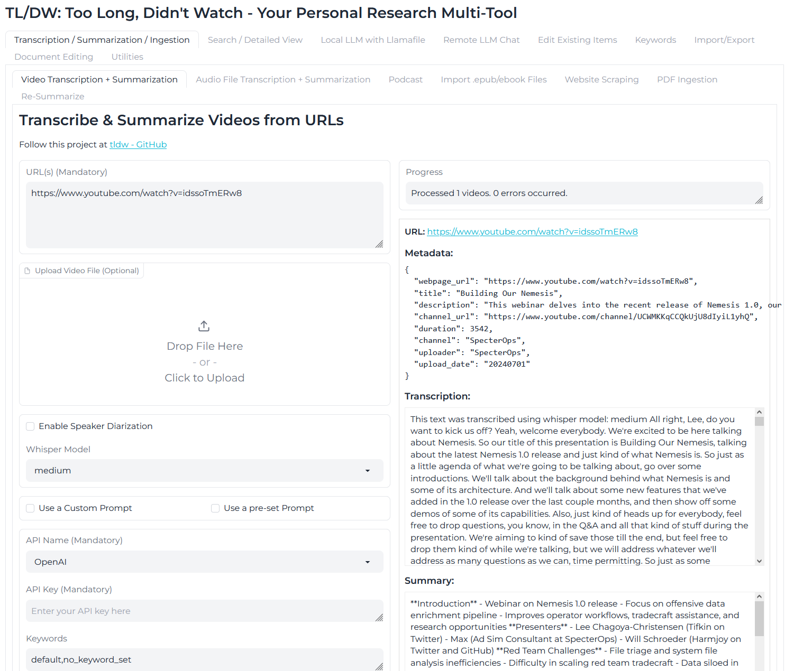

# **TL/DW: Too Long, Didnt Watch**
## Download, Transcribe & Summarize Videos. All automated (+ More)
#### More: Website Article scraping+summarization, Full-Text-Search across everything ingested, Local LLM inference as part of the script for those who don't want to mess with setting up an LLM, and a WebApp to interact with the script in a more user-friendly manner (all features are exposed through it).
## [Public Demo](https://huggingface.co/spaces/oceansweep/Vid-Summarizer)


----------

### Table of Contents
- [What?](#what) | [Quickstart](#quickstart) | [Setup](#setup) | [Using tldw](#using) | [What's in the Repo / Pieces](#what) | [Setting up a Local LLM Inference Engine](#localllm) | [Credits](#credits)

----------

### <a name="what"></a> What is this (TL/DW)?
- **Don't care, give me code**
  - Take a URL, a single video, a list of URLs, or list of local videos + URLs, one per line in a text file, and feed it into the script and have each video transcribed (faster-whisper), summarized (Your LLM of choice), and ingested into a SQLite DB.
  * `git clone https://github.com/rmusser01/tldw` -> `cd tldw` -> `python -m venv .\` -> `. .\scripts\activate.ps1` -> `pip install -r requirements.txt` -> 
    * CLI usage: `python summarize.py https://www.youtube.com/watch?v=4nd1CDZP21s -api openai -k tag_one tag_two tag_three` 
    - GUI usage: `python summarize.py -gui`
    - GUI with local LLM: `python summarize.py -gui --local_llama`
- **Short Summary**
  - Take a URL, single video, list of URLs, or list of local videos + URLs and feed it into the script and have each video transcribed (and audio downloaded if not local) using faster-whisper. 
  - Transcriptions can then be shuffled off to an LLM API endpoint of your choice, whether that be local or remote. 
  - Rolling summaries (i.e. chunking up input and doing a chain of summaries) is supported only through OpenAI currently, though the [scripts here](https://github.com/the-crypt-keeper/tldw/tree/main/tldw-original-scripts) will let you do it with exllama or vLLM, using the scripts in there for the entire pipeline.
  - Any site supported by yt-dl is supported, so you can use this with sites besides just youtube. (List of supported sites: https://github.com/yt-dlp/yt-dlp/blob/master/supportedsites.md )

- **Longer Summary/Goal**
  - To be able to act as an ingestion tool for personal database storage. The idea being that there is so much data one comes across, and we can store it all as text.
  - Imagine, if you were able to keep a copy of every talk, research paper or article you've ever read, and have it at your finger tips in a moments notice.
  - Now, imagine if you could ask questions about that data/information(LLM), and be able to string it together with other pieces of data, to try and create sense of it all (RAG)
  - The end goal of this project, is to be a personal data assistant, that ingests recorded audio, videos, articles, free form text, documents, and books as text into a SQLite (for now, would like to build a shim for ElasticSearch/Similar) DB, so that you can then search across it at any time, and be able to retrieve/extract that information, as well as be able to ask questions about it. (Plus act as a nice way of personally tagging data for possible future training of your personal AI agent :P)
    * On the to-do list to see about creating some form of structure within the plain text to make review/reconstruction a little easier(markdown?) - Reconstruction being review of the data for raw consumption and not fed into an analysis pipeline.
  - And of course, this is all open-source/free, with the idea being that this can massively help people in their efforts of research and learning.

For commercial API usage, I personally recommend Claude Sonnet. It's great quality and relatively inexpensive.

For offline LLM usage, I recommend the following fine-tuned Mistral-Instruct v0.2 model:
  * https://huggingface.co/cognitivetech/samantha-mistral-instruct-7b_bulleted-notes_GGUF

Alternatively, there is https://huggingface.co/microsoft/Phi-3-mini-128k-instruct, which you can get in a GGUF format from here: https://huggingface.co/gaianet/Phi-3-mini-128k-instruct-GGUF
  * Or you can let the script download and run a local server for you, using llama.cpp/llamafile and one of the above models. 
    * (It'll ask you if you want to download one, and if so, which one out of a choice of 3) 
----------

**CLI Screenshot**
- **See [Using](#using)**


**GUI Screenshot**


----------

### Quickstart
  1. Update your drivers.
  2. Install Python3 for your platform - https://www.python.org/downloads/
  3. Download the repo: `git clone https://github.com/rmusser01/tldw` or manually download it (Green code button, upper right corner -> Download ZIP) and extract it to a folder of your choice.
  4. Open a terminal, navigate to the directory you cloned the repo to, or unzipped the downloaded zip file to, and run the following commands:
     - Create a virtual env: `python -m venv .\`
     - Launch/activate your virtual env: `. .\scripts\activate.ps1`
       * If you don't already have cuda installed(Nvidia), `py -m pip install --upgrade pip wheel` & `pip install torch==2.2.2 torchvision==0.17.2 torchaudio==2.2.2 --index-url https://download.pytorch.org/whl/cu118` 
       * Or CPU Only: `pip install torch==2.2.2 torchvision==0.17.2 torchaudio==2.2.2 --index-url https://download.pytorch.org/whl/cpu`
     - `pip install -r requirements.txt` - may take a bit of time...
  5. **You are Ready to Go!** Check out the below sample commands: 

- **Transcribe audio from a Youtube URL:**
  * `python summarize.py https://www.youtube.com/watch?v=4nd1CDZP21s`

- **Transcribe audio from a Youtube URL & Summarize it using (`anthropic`/`cohere`/`openai`/`llama` (llama.cpp)/`ooba` (oobabooga/text-gen-webui)/`kobold` (kobold.cpp)/`tabby` (Tabbyapi)) API:**
  * `python summarize.py https://www.youtube.com/watch?v=4nd1CDZP21s -api <your choice of API>`
    - Make sure to put your API key into `config.txt` under the appropriate API variable

- **Transcribe a list of Youtube URLs & Summarize them using (`anthropic`/`cohere`/`openai`/`llama` (llama.cpp)/`ooba` (oobabooga/text-gen-webui)/`kobold` (kobold.cpp)/`tabby` (Tabbyapi)) API:**
  * `python summarize.py ./ListofVideos.txt -api <your choice of API>`
    - Make sure to put your API key into `config.txt` under the appropriate API variable

- **Transcribe & Summarize a List of Videos on your local filesytem with a text file:**
  * `python summarize.py -v ./local/file_on_your/system`

- **Download a Video with Audio from a URL:**
  * `python summarize.py -v https://www.youtube.com/watch?v=4nd1CDZP21s`s

- **Perform a 'rolling' summarization of a longer transcript**
  * `python summarize.py -roll -detail 0.01 https://www.youtube.com/watch?v=4nd1CDZP21s`
    * Detail can go from `0.01` to `1.00`, increments at a measure of `.01`.

- **Run it as a WebApp**
  * `python summarize.py -gui` - This requires you to either stuff your API keys into the `config.txt` file, or pass them into the app every time you want to use it.
    * It exposes every CLI option, and has a nice toggle to make it 'simple' vs 'Advanced'
    * Has an option to download the generated transcript, and summary as text files from the UI.
    * Can also download video/audio as files if selected in the UI (WIP - doesn't currently work)
    - Gives you access to the whole SQLite DB backing it, with search, tagging, and export functionality
      * Yes, that's right. Everything you ingest, transcribe and summarize is tracked through a local(!) SQLite DB.
      * So everything you might consume during your path of research, tracked and assimilated and tagged.
      * All into a shareable, single-file DB that is open source and extremely well documented. (The DB format, not this project :P) 
----------
### <a name="setup"></a>Setting it up
- **Requirements**
  - Python3
  - ffmpeg
  - GPU Drivers/CUDA drivers or CPU-only PyTorch installation for ML processing
    - AMD GPUs are not supported by PyTorch, so you'll need to use a CPU-only installation.
    - Apparently there is a ROCm version of PyTorch, but I haven't tested it.
      - https://github.com/llvm/torch-mlir
      - https://learn.microsoft.com/en-us/windows/ai/directml/pytorch-windows
  - API keys for the LLMs you want to use (or use the local LLM option/Self-hosted)
  - System RAM (8GB minimum, realistically 12GB)
  - Disk Space (Depends on how much you ingest, but a few GBs (4+) should be fine for the total size of the project + DB)
- **Linux**
    1. Download necessary packages (Python3, ffmpeg - `sudo apt install ffmpeg / dnf install ffmpeg`, Update your GPU Drivers/CUDA drivers if you'll be running an LLM locally)
    2. Open a terminal, navigate to the directory you want to install the script in, and run the following commands:
    3. `git clone https://github.com/rmusser01/tldw`
    4. `cd tldw`
    5. Create a virtual env: `python -m venv ./`
    6. Launch/activate your virtual env: `. .\scripts\activate.sh`
    7. Setup the necessary python packages:
       * Following is from: https://docs.nvidia.com/deeplearning/cudnn/latest/installation/linux.html
       * If you don't already have cuda installed, `py -m pip install --upgrade pip wheel` & `pip install torch==2.2.2 torchvision==0.17.2 torchaudio==2.2.2 --index-url https://download.pytorch.org/whl/cu118` 
       * Or CPU Only: `pip install torch==2.2.2 torchvision==0.17.2 torchaudio==2.2.2 --index-url https://download.pytorch.org/whl/cpu`
       * https://pytorch.org/get-started/previous-versions/#linux-and-windows-3
    8. Then see `Linux && Windows`
- **Windows**
    1. Download necessary packages ([Python3](https://www.python.org/downloads/windows/), Update your GPU drivers/CUDA drivers if you'll be running an LLM locally, ffmpeg will be installed by the script)
    2. Open a terminal, navigate to the directory you want to install the script in, and run the following commands:
    3. `git clone https://github.com/rmusser01/tldw`
    4. `cd tldw`
    5. Create a virtual env: `python -m venv ./`
    6. Launch/activate your virtual env: PowerShell: `. .\scripts\activate.ps1` or for CMD: `.\scripts\activate.bat`
    7. Setup the necessary python packages:
       * https://docs.nvidia.com/deeplearning/cudnn/latest/installation/windows.html
       * If you don't already have cuda installed, `py -m pip install --upgrade pip wheel` & `pip install torch==2.2.2 torchvision==0.17.2 torchaudio==2.2.2 --index-url https://download.pytorch.org/whl/cu118` 
       * Or CPU Only: `pip install torch==2.2.2 torchvision==0.17.2 torchaudio==2.2.2 --index-url https://download.pytorch.org/whl/cpu`
       * https://pytorch.org/get-started/previous-versions/#linux-and-windows-3
    8. See `Linux && Windows`
- **Linux && Windows**
    1. `pip install -r requirements.txt` - may take a bit of time...
    2. **Script Usage:**
       - Put your API keys and settings in the `config.txt` file.
       - (make sure your in the python venv - `./scripts/activate.sh` or `.\scripts\activate.ps1` or `.\scripts\activate.bat`)
       - Run `python ./summarize.py <video_url>` - The video URL does _not_ have to be a youtube URL. It can be any site that ytdl supports.
       - You'll then be asked if you'd like to run the transcription through GPU(1) or CPU(2).
         - Next, the video will be downloaded to the local directory by ytdl.
         - Then the video will be transcribed by faster_whisper. (You can see this in the console output)
           * The resulting transcription output will be stored as both a json file with timestamps, as well as a txt file with no timestamps.
       - Finally, you can have the transcription summarized through feeding it into an LLM of your choice.
    3. **GUI Usage:
       - Put your API keys and settings in the `config.txt` file.
       - (make sure your in the python venv - `./scripts/activate.sh` or `.\scripts\activate.ps1` or `.\scripts\activate.bat`)
       - Run `python ./summarize.py -gui` - This will launch a webapp that will allow you to interact with the script in a more user-friendly manner.
         * You can pass in the API keys for the LLMs you want to use in the `config.txt` file, or pass them in when you use the GUI.
         * You can also download the generated transcript and summary as text files from the UI.
         * You can also download the video/audio as files from the UI. (WIP - doesn't currently work)
         * You can also access the SQLite DB that backs the app, with search, tagging, and export functionality.
    4. **Local LLM with the Script Usage:**
       - (make sure your in the python venv - `./scripts/activate.sh` or `.\scripts\activate.ps1` or `.\scripts\activate.bat`)
       - I recognize some people may like the functionality and idea of it all, but don't necessarily know/want to know about LLMs/getting them working, so you can also have the script download and run a local model, using system RAM and llamafile/llama.cpp.
       - Simply pass `--local_llm` to the script (`python summarize.py --local-llm`), and it'll ask you if you want to download a model, and which one you'd like to download.
       - Then, after downloading and selecting a model, it'll launch the model using llamafile, so you'll have a browser window/tab opened with a frontend to the model/llama.cpp server.
       - You'll also have the GUI open in another tab as well, a couple seconds after the model is launched, like normal.
       - You can then interact with both at the same time, being able to ask questions directly to the model, or have the model ingest output from the transcript/summary and use it to ask questions you don't necessarily care to have stored within the DB. (All transcripts, URLs processed, prompts used, and summaries generated, are stored in the DB, so you can always go back and review them or re-prompt with them)

----------
### <a name="using"></a>Using tldw
- Single file (remote URL) transcription
  * Single URL: `python summarize.py https://example.com/video.mp4`
- Single file (local) transcription)
  * Transcribe a local file: `python summarize.py /path/to/your/localfile.mp4`
- Multiple files (local & remote)
  * List of Files(can be URLs and local files mixed): `python summarize.py ./path/to/your/text_file.txt"`
- Download and run an LLM using only your system RAM! (Need at least 8GB Ram, realistically 12GB)
  * `python summarize.py -gui --local_llama`

Save time and use the `config.txt` file, it allows you to set these settings and have them used when ran.
```
positional arguments:
  input_path            Path or URL of the video

options:
  -h, --help            show this help message and exit
  -v, --video           Download the video instead of just the audio
  -api API_NAME, --api_name API_NAME
                        API name for summarization (optional)
  -key API_KEY, --api_key API_KEY
                        API key for summarization (optional)
  -ns NUM_SPEAKERS, --num_speakers NUM_SPEAKERS
                        Number of speakers (default: 2)
  -wm WHISPER_MODEL, --whisper_model WHISPER_MODEL
                        Whisper model (default: small.en)
  -off OFFSET, --offset OFFSET
                        Offset in seconds (default: 0)
  -vad, --vad_filter    Enable VAD filter
  -log {DEBUG,INFO,WARNING,ERROR,CRITICAL}, --log_level {DEBUG,INFO,WARNING,ERROR,CRITICAL}
                        Log level (default: INFO)
  -gui, --user_interface
                        Launch the Gradio user interface
  -demo, --demo_mode    Enable demo mode
  -prompt CUSTOM_PROMPT, --custom_prompt CUSTOM_PROMPT
                        Pass in a custom prompt to be used in place of the existing one.
                         (Probably should just modify the script itself...)
  -overwrite, --overwrite
                        Overwrite existing files
  -roll, --rolling_summarization
                        Enable rolling summarization
  -detail DETAIL_LEVEL, --detail_level DETAIL_LEVEL
                        Mandatory if rolling summarization is enabled, defines the chunk  size.
                         Default is 0.01(lots of chunks) -> 1.00 (few chunks)
                         Currently only OpenAI works.
  --chunk_duration CHUNK_DURATION
                        Duration of each chunk in seconds
  -time TIME_BASED, --time_based TIME_BASED
                        Enable time-based summarization and specify the chunk duration in seconds (minimum 60 seconds, increments of 30 seconds)
  -model LLM_MODEL, --llm_model LLM_MODEL
                        Model to use for LLM summarization (only used for vLLM/TabbyAPI)
  -k KEYWORDS [KEYWORDS ...], --keywords KEYWORDS [KEYWORDS ...]
                        Keywords for tagging the media, can use multiple separated by spaces (default: cli_ingest_no_tag)
  --log_file LOG_FILE   Where to save logfile (non-default)
  --local_llm           Use a local LLM from the script(Downloads llamafile from github and 'mistral-7b-instruct-v0.2.Q8' - 8GB model from Huggingface)
  --server_mode         Run in server mode (This exposes the GUI/Server to the network)
  --share_public SHARE_PUBLIC
                        This will use Gradio's built-in ngrok tunneling to share the server publicly on the internet. Specify the port to use (default: 7860)
  --port PORT           Port to run the server on


Sample commands:
    1. Simple Sample command structure:
        summarize.py <path_to_video> -api openai -k tag_one tag_two tag_three

    2. Rolling Summary Sample command structure:
        summarize.py <path_to_video> -api openai -prompt "custom_prompt_goes_here-is-appended-after-transcription" -roll -detail 0.01 -k tag_one tag_two tag_three

    3. FULL Sample command structure:
        summarize.py <path_to_video> -api openai -ns 2 -wm small.en -off 0 -vad -log INFO -prompt "custom_prompt" -overwrite -roll -detail 0.01 -k tag_one tag_two tag_three

    4. Sample command structure for UI:
        summarize.py -gui -log DEBUG
```
- Download Audio only from URL -> Transcribe audio:
  >python summarize.py https://www.youtube.com/watch?v=4nd1CDZP21s

- Transcribe audio from a Youtube URL & Summarize it using (anthropic/cohere/openai/llama (llama.cpp)/ooba (oobabooga/text-gen-webui)/kobold (kobold.cpp)/tabby (Tabbyapi)) API:
  >python summarize.py https://www.youtube.com/watch?v=4nd1CDZP21s -api <your choice of API>
    - Make sure to put your API key into `config.txt` under the appropriate API variable

- Download Video with audio from URL -> Transcribe audio from Video:
  >python summarize.py -v https://www.youtube.com/watch?v=4nd1CDZP21s

- Download Audio+Video from a list of videos in a text file (can be file paths or URLs) and have them all summarized:
  >python summarize.py --video ./local/file_on_your/system --api_name <API_name>

- Transcribe & Summarize a List of Videos on your local filesytem with a text file:
  >python summarize.py -v ./local/file_on_your/system

- Run it as a WebApp:
  >`python summarize.py -gui

By default videos, transcriptions and summaries are stored in a folder with the video's name under './Results', unless otherwise specified in the config file.


------------

### <a name="localllm"></a>Setting up a Local LLM Inference Engine
- **Setting up Local LLM Runner**
  - **Llama.cpp**
    - **Linux & Mac**
      1. `git clone https://github.com/ggerganov/llama.cpp`
      2. `make` in the `llama.cpp` folder 
      3. `./server -m ../path/to/model -c <context_size>`
    - **Windows**
      1. `git clone https://github.com/ggerganov/llama.cpp`
      2. Download + Run: https://github.com/skeeto/w64devkit/releases
      3. cd to `llama.cpp` folder make` in the `llama.cpp` folder
      4. `server.exe -m ..\path\to\model -c <context_size>`
  - **Kobold.cpp** - c/p'd from: https://github.com/LostRuins/koboldcpp/wiki
    - **Windows**
      1. Download from here: https://github.com/LostRuins/koboldcpp/releases/latest
      2. `Double click KoboldCPP.exe and select model OR run "KoboldCPP.exe --help" in CMD prompt to get command line arguments for more control.`
      3. `Generally you don't have to change much besides the Presets and GPU Layers. Run with CuBLAS or CLBlast for GPU acceleration.`
      4. `Select your GGUF or GGML model you downloaded earlier, and connect to the displayed URL once it finishes loading.`
    - **Linux**
      1. `On Linux, we provide a koboldcpp-linux-x64 PyInstaller prebuilt binary on the releases page for modern systems. Simply download and run the binary.`
        * Alternatively, you can also install koboldcpp to the current directory by running the following terminal command: `curl -fLo koboldcpp https://github.com/LostRuins/koboldcpp/releases/latest/download/koboldcpp-linux-x64 && chmod +x koboldcpp`
      2. When you can't use the precompiled binary directly, we provide an automated build script which uses conda to obtain all dependencies, and generates (from source) a ready-to-use a pyinstaller binary for linux users. Simply execute the build script with `./koboldcpp.sh dist` and run the generated binary.
  - **oobabooga - text-generation-webui** - https://github.com/oobabooga/text-generation-webui
    1. Clone or download the repository.
      * Clone: `git clone https://github.com/oobabooga/text-generation-webui`
      * Download: https://github.com/oobabooga/text-generation-webui/releases/latest -> Download the `Soruce code (zip)` file -> Extract -> Continue below.
    2. Run the `start_linux.sh`, `start_windows.bat`, `start_macos.sh`, or `start_wsl.bat` script depending on your OS.
    3. Select your GPU vendor when asked.
    4. Once the installation ends, browse to http://localhost:7860/?__theme=dark.
  - **Exvllama2**
- **Setting up a Local LLM Model**
  1. microsoft/Phi-3-mini-128k-instruct - 3.8B Model/7GB base, 4GB Q8 - https://huggingface.co/microsoft/Phi-3-mini-128k-instruct
    * GGUF Quants: https://huggingface.co/pjh64/Phi-3-mini-128K-Instruct.gguf
  2. Meta Llama3-8B - 8B Model/16GB base, 8.5GB Q8  - https://huggingface.co/meta-llama/Meta-Llama-3-8B-Instruct
    * GGUF Quants: https://huggingface.co/lmstudio-community/Meta-Llama-3-8B-Instruct-GGUF


----------


### <a name="pieces"></a>Pieces & What's in the original repo?
- **What's in the original repo?**
  - `summarize.py` - download, transcribe and summarize audio
    1. First uses [yt-dlp](https://github.com/yt-dlp/yt-dlp) to download audio(optionally video) from supplied URL
    2. Next, it uses [ffmpeg](https://github.com/FFmpeg/FFmpeg) to convert the resulting `.m4a` file to `.wav`
    3. Then it uses [faster_whisper](https://github.com/SYSTRAN/faster-whisper) to transcribe the `.wav` file to `.txt`
    4. After that, it uses [pyannote](https://github.com/pyannote/pyannote-audio) to perform 'diarorization'
    5. Finally, it'll send the resulting txt to an LLM endpoint of your choice for summarization of the text.
  - `chunker.py` - break text into parts and prepare each part for LLM summarization
  - `roller-*.py` - rolling summarization
    - [can-ai-code](https://github.com/the-crypt-keeper/can-ai-code) - interview executors to run LLM inference
  - `compare.py` - prepare LLM outputs for webapp
  - `compare-app.py` - summary viewer webapp

------------
### Similar/Other projects:
- https://github.com/Dicklesworthstone/bulk_transcribe_youtube_videos_from_playlist/tree/main
- https://github.com/akashe/YoutubeSummarizer
- https://github.com/fmeyer/tldw
- https://github.com/pashpashpash/vault-ai <-- Closest I've found open source to what I'm looking to build, though I'm not looking to add RAG for a while, and I'm focused on just accumulation, I figure at some point in the future can tackle chunking of hte longer form items in a manner that makes sense/is effective, but until then, data storage is cheap and text is small. And SQLite is easy to share with people. Also, no commercial aspects, this project's goal is to be able to be ran completely offline/free from outside influence.
- Commercial offerings:
  * Bit.ai 
  * 
------------

### <a name="credits"></a>Credits
- [The original version of this project by @the-crypt-keeper](https://github.com/the-crypt-keeper/tldw)
- [yt-dlp](https://github.com/yt-dlp/yt-dlp)
- [ffmpeg](https://github.com/FFmpeg/FFmpeg)
- [faster_whisper](https://github.com/SYSTRAN/faster-whisper)
- [pyannote](https://github.com/pyannote/pyannote-audio)
- Thank you cognitivetech for the system prompt(not yet implemented...): https://github.com/cognitivetech/llm-long-text-summarization/tree/main?tab=readme-ov-file#one-shot-prompting

### 