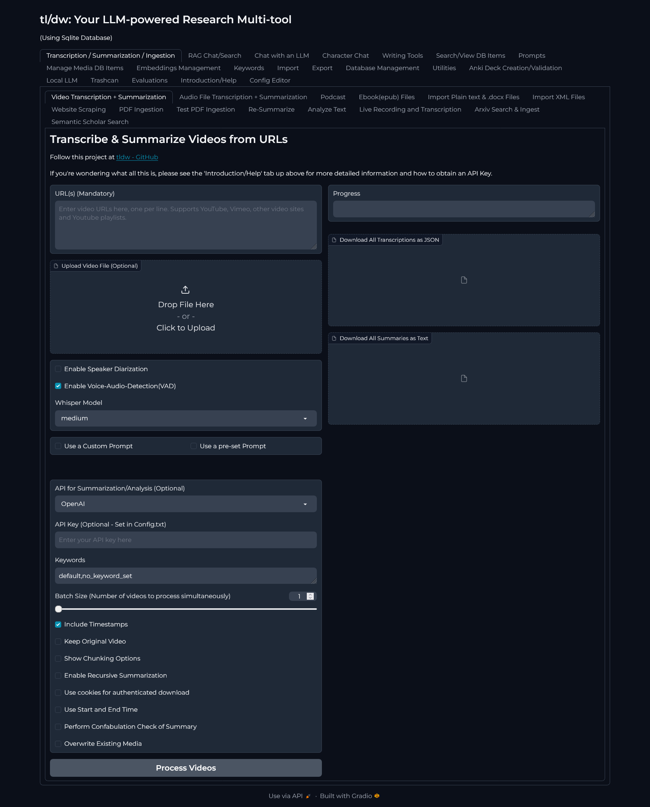

<div align="center">

<h1>tl/dw</h1>

[](https://img.shields.io/badge/license-apache2.0-green)
[](https://github.com/rmusser01/tldw) 

<h3>Your personal research multi-tool</h3>
<h3>Download, Transcribe, Summarize/Analyze & then Chat with/about Videos, Audio, Documents, Web Articles, and Books.</h3>

## All Automated. All Local. All Yours.
</div>

Latest Update (4/25/2025):
README needs to be updated....
tl/dr:

    The API is functional, and the GUI is being worked on.
    App is working, but DB replacement/integration of a syncing library is being worked on. Not pushing to main until this is done.
    When the syncing library is done and the API endpoint exists/whole thing works, I'll push to main. (should be soon)
    Working Endpoints:
        POST /media/process-videos
        POST /media/process-audios
        POST /media/process-pdfs
        POST /media/process-ebooks
        POST /media/process-texts
        GET /media/
        GET/PUT media/{id}
        GET /media/{id}/versions
        GET/DELETE /media/{id}/versions/{version_number}
        POST /media/{id}/versions/rollback
        GET /media/search
        POST /media/add
        GET /media/debug/schema
        POST /api/v1/chat/completions (Following OpenAI API spec)
    The GUI will be a TUI for now(https://github.com/rmusser01/tldw_chatbook). WebApp eventually.
    The API is not fully documented(thanks FastAPI autodoc), but the endpoints are functional.
    The project is being actively developed, and I am looking for help with the GUI. (webapp specifically, but help with TUI is also welcome))
    If you want to help out, please reach out via the Issues page, discussions page or email.

FastAPI API is implemented.
Processing endpoints for Audio, video, pdf, ebook and plain text are implemented, as well as ingestion into the DB.
The API is fully functional for those endpoints (I've also added an openai chat endpoint as well, but not extensively tested)
API is not fully documented besides the autodoc from FastAPI.
Currently, there are two main development focuses of the project:

    The API
        Migration from the existing MediaDB to the new API DB. The biggest change is the combination of the chat DBs into one, and allowing for synchronization of the DBs. So you'll be able to have your local instance synced with your 'home' server. (WIP)
        Once the Sync Library is fully implemented, tested, and confirmed working, I'll be working on the API endpoints for the sync library. (should be quick)
        After that, I'll be working on the API endpoint for 'search' aka RAG. (Will be revisiting the pipeline for improvements)
        After RAG, I'll be revisiting the Chat Library for chat dictionary support and other improvements relating to it.
    The GUI
        I am not a web dev. I do however, happen to know that TUIs exist, and as such, am building one at https://github.com/rmusser01/tldw_chatbook (currently usable as a standalone chat client)
        It will be the primary/'official' GUI for the tldw server (for now, eventually will do a webUI and make that the main UI)
        The app, 'tldw_chatbook' or 'chatbook', is a TUI built using Textual. It is designed to be a standalone chat client, so that it can be used separately from tldw.
        The goal of chatbook is to provide a simple, easy-to-use interface for interacting with the tldw server API, completely offline and local.
        This means that ideally, every server option/API endpoint (minus user reg?) will be available in chatbook.
        Where this is going, is that you'll be able to have your local chatbook client, and be able to sync it to your home server, and download your chats/settings/media DB.
        You'll also be able to use the '/media/process-*' endpoints, to process your media, store the results in your local media DB, and then sync it to your home server if you want.
        So you can keep your local media DB up to date, and then sync it to your home server/vice versa.
        This has extended the timeline for an initial release, but I think it will be worth it in the end.
        I do plan on opening up a Discord server for the project, but I don't have the time to manage it right now. So if you want to help out, please feel free to reach out via the Issues page, discussions page or email.


### [Public Demo on HuggingFace Spaces](https://huggingface.co/spaces/oceansweep/Vid-Summarizer/?__theme=dark)- Demo is not working!
- Demo is not currently working and is being updated. Please use the local version for now.
<details> 
<summary>Public Demo Info</summary>

- Please note that YouTube blocks requests from the demo. You have to provide a logged-in session cookie to bypass it :frowning_face: 
- Placeholder content is included for the demo. HuggingFace API is also setup in it, so you can select that as your API.)
</details>


#### About this Project
<details>
<summary>About this Project</summary>

- This project started as a tool by `the-crypt-keeper` to perform summarization of YouTube videos.
- I forked it, to add a couple features as I wanted to use it to help me consume conference videos at a faster pace. I kept adding/improving things and now it's a fully different tool/focus.
- You can find the original scripts by `the-crypt-keeper` in the `tldw-original-scripts` directory, a snapshot of the files before I made my changes.
- The GUI is currently a placeholder. Please excuse its crappiness for now. It will be replaced with a FastAPI backend and a new JS frontend. (Gradio is a placeholder UI)
</details>

### Updating from a version installed prior to X date:

<details>
<summary>Jan 3rd:</summary>

- If you're updating from a prior version, your config.txt file needs to be updated.
- You can either just use the new config file and copy over your old values, or you can just add the new values to your existing config file.
- Either way, the app won't work unless the config file is updated.
- If you're reading this, then you're already on the latest version, so you can just update the config file and you'll be good to go.
</details>

Nov 1st:
<details>

- If you're updating from a version published prior to Nov 1st, your Media DB is not compatible with the new version. You'll need to start fresh.
- I've written a script to help you migrate your data from the old DB to the new one. `Helper_Scripts/DB-Related/migrate_db.py`.
- Process to migrate your data:
  1. Install/run the new version of the app. This will create a new `media_summary.db` file in the `Databases` directory.
  2. Run the `migrate_db.py` script with the old and new DB paths as arguments. - `python migrate_db.py --source media_summary_old.db --target media_summary_new.db --export-path .\`
  3. This will migrate all your data from the old DB to the new one, and export the saved conversations to the `export-path` you specify.
  4. Re-import any/all saved conversations into the new RAG_QA_Chat.db 
</details>


#### 

### Screenshots of the UI
Screenshot of the Frontpage 


#### Key Features:
<details>
<summary>Key Features</summary>

- Ingest(Transcribe/convert to markdown) content from (multiple) URLs or local files (video, audio, documents, web articles, books, mediawiki dumps) -> Summarize/Analyze -> Chat with/about the content.- Build up a personal knowledge archive, then turn around and use the LLM to help you learn it at a pace your comfortable with.
- **Full Plaintext & RAG Search Capability** Search across all ingested content via RAG or 'old-fashioned non-LLM search' (RAG being BM25 + Vector Search/Contextual embeddings + Re-ranking + Contextual Retrieval).
  - Search by content, title, author, URL, or tags, with support for meta-tags, so that you can have the equivalent of 'folders' for your content (and tags).
  - If you'd like to see my notes on RAG: see `./Docs/RAG_Notes.md`
  - Notes support, ala NotebookLM, so you can keep track of your thoughts and ideas while chatting/learning, with the ability to search across them or use them for RAG.
- **Local LLM inference for offline usage and chat** - via `llamafile`/`HuggingFace Transformers`.
- **4 Different Chat UI styles** - Regular chat, Stacked chat, Multi-Response chat(1 Prompt, 3 APIs) and 4 Separate API chats on one page.
- **Local Embeddings Generation for RAG Search** - via `llamafile`/`llama.cpp`/`HuggingFace Transformers`.
- Also writing tools! Grammar/Style checker, Tone Analyzer, Writing editor(feedback), and more.
- **Full Character Chat Support** - Create/Edit & Import/Export Character Cards, and chat with them.
- **Arxiv API Integration** - Search and ingest papers from Arxiv.
- **Chat Workflows** - A way to string together multiple questions and responses into a single chat. - Use it to create a 'workflow' for a specific task. Configured via a JSON file.
- **Import Obsidian Notes/Vault** - Import Obsidian Vaults into the DB. (Imported notes are automatically parsed for tags and titles)
- **Backup Management** - A way to back up the DBs, view backups, and restore from a backup. (4 SQLite DBs: Media, Character Chats, RAG Chats, Embeddings)
- **Trashcan Support** - A way to 'soft' delete content, and restore it if needed. (Helps with accidental deletions) - Trashcan is only for the MediaDB.
- **Support for 7 Local LLM APIs:** `Llama.cpp`, `Kobold.cpp`, `Oobabooga`, `TabbyAPI`, `vLLM`, `Ollama`, `Aphrodite`, `Custom OpenAI API`.
- **Support for 9 Commercial APIs:** `Claude Sonnet 3.5`, `Cohere Command R+`, `DeepSeek`, `Google`, `Groq`, `HuggingFace`, `Mistral`, `OpenAI`, `OpenRouter`.
- **Local Audio Recording with Transcription** - Record audio locally and transcribe it.
- **Structured Prompt Creation and Management** - Create prompts using a structured approach, and then edit and use them in your chats. Or delete them.
  - Also have the ability to import prompts individually or in bulk. As well as export them as markdown documents.
  - See `./Docs/Prompts/` for examples of prompts. and `./Docs/Propmts/TEMPLATE.md` for the prompt template used in tldw.
- Features to come: Migration to a FastAPI backend(Gradio is a placeholder UI). Anki Flashcard Deck Editing (Creation is in), Mindmap creation from content(currently in under `Utilities`, uses PlantUML), better document handling, and more.
</details>

#### The original scripts by `the-crypt-keeper` for transcribing and summarizing youtube videos are available here: [scripts here](https://github.com/the-crypt-keeper/tldw/tree/main/tldw-original-scripts)


----------
### Table of Contents
- [What?](#what) | [Quickstart](#quickstart) | [Setup](#setup) | [Using tldw](#using) | [What's in the Repo / Pieces](#whatbox) | [Helpful Terms and Things to Know](#helpful) | [Setting up a Local LLM Inference Engine](#localllm) | [Credits](#credits) | [Roadmap Plans](#plans) | 

#### Quickstart
<details>
<summary>Quickstart - Click-Here</summary>

### QuickStart
- **Bash/Batch Script:**
  - **Use the Installer Script! Download and run it to install the necessary packages + launch tl/dw**
    - **Linux:** `wget https://raw.githubusercontent.com/rmusser01/tldw/main/Helper_Scripts/Installer_Scripts/Linux_Install_Update.sh && wget https://raw.githubusercontent.com/rmusser01/tldw/main/Helper_Scripts/Installer_Scripts/Linux_Run_tldw.sh`
      - Install the necessary packages: `ffmpeg portaudio19-dev gcc build-essential python3-dev`
      - `chmod +x Linux_Install_Update.sh && ./Linux_Run_tldw.sh`
      - Now run the executable installer script: `./Linux_Install_Update.sh`
      - Then Run the app: `./Linux_Run_tldw.sh`
      - You should now have a web browser tab opened to `http://127.0.0.1:7860/` with the GUI for the app.
    - **MacOS:** `wget https://raw.githubusercontent.com/rmusser01/tldw/main/Helper_Scripts/Installer_Scripts/MacOS_Install_Update.sh`
      - `bash MacOS-Run-Install-Update.sh`
      - You should now have a web browser tab opened to `http://127.0.0.1:7860/` with the GUI for the app.
    - **Windows:** `curl -O https://raw.githubusercontent.com/rmusser01/tldw/main/Helper_Scripts/Installer_Scripts/Windows_Install_Update.bat` and then `curl -O https://raw.githubusercontent.com/rmusser01/tldw/main/Helper_Scripts/Installer_Scripts/Windows_Run_tldw.bat`
        - Then double-click the downloaded batch file `Windows_Install_Update.bat` to install it, and `Windows_Run_tldw.bat` to run it.
        - You should now have a web browser tab opened to `http://127.0.0.1:7860/` with the GUI for the app.
        - If you don't have CUDA installed on your system and available in your system path, go here: https://github.com/Purfview/whisper-standalone-win/releases/download/Faster-Whisper-XXL/Faster-Whisper-XXL_r192.3.4_windows.7z
          - Extract the two files named `cudnn_ops_infer64_8.dll` and `cudnn_cnn_infer64_8.dll` from the 7z file to the `tldw` directory, and then run the `Windows_Run_tldw.bat` file.
          - This will allow you to use the faster whisper models with the app. Otherwise, you won't be able to perform transcription.
  - **BE SURE TO UPDATE 'config.txt' WITH YOUR API KEYS AND SETTINGS!** 
    - You need to do this unless you want to manually input your API keys everytime you interact with a commercial LLM...
- **Run it as a WebApp**
  * `python summarize.py -gui` - This requires you to either stuff your API keys into the `config.txt` file, or pass them into the app every time you want to use it.
    * It exposes every CLI option, and has a nice toggle to make it 'simple' vs 'Advanced'
    - Gives you access to the whole SQLite DB backing it, with search, tagging, and export functionality
      * Yes, that's right. Everything you ingest, transcribe and summarize is tracked through a local(!) SQLite DB.
      * So everything you might consume during your path of research, tracked and assimilated and tagged.
      * All into a shareable, single-file DB that is open source and extremely well documented. (The DB format, not this project :P) 
  - You should now have a web browser tab opened to `http://127.0.0.1:7860/` with the GUI for the app.
- **Docker:**
  - There's a docker build for GPU use(Needs Nvidia CUDA Controller(?): https://github.com/rmusser01/tldw/blob/main/Helper_Scripts/Dockerfiles/tldw-nvidia_amd64_Dockerfile 
  - and plain CPU use: https://github.com/rmusser01/tldw/blob/main/Helper_Scripts/Dockerfiles/tldw_Debian_cpu-Dockerfile
  - the `Dockerfile` in the main directory is the Nvidia base-image-based one. So you can use your GPU if you want with it.
</details>

### Overview of what tl/dw currenlty is
<details>
<summary>What is this? - Click-Here</summary>

### What is tl/dw?
**tl/dw** is a versatile tool designed to help you manage and interact with media files (videos, audio, documents, web articles, and books) by:
1. **Ingesting**: Importing media from URLs or local files into an offline database.
2. **Transcribing**: Automatically generating text transcripts from videos and audio using various whisper models using faster_whisper.
3. **Analyzing(Not Just Summarizing)**: Using LLMs (local or API-based) to perform analyses of the ingested content.
4. **Searching**: Full-text search across ingested content, including metadata like titles, authors, and keywords.
5. **Chatting**: Interacting with ingested content using natural language queries through supported LLMs.

All features are designed to run **locally** on your device, ensuring privacy and data ownership. The tool is open-source and free to use, with the goal of supporting research, learning, and personal knowledge management.

### Key Features

#### Content Ingestion
- Supports video, audio, documents (epub, PDF, txt), and web articles from URLs or local files.
- Drag-and-drop functionality for easy local file ingestion.
- Compatible with any site supported by yt-dlp (see [supported sites](https://github.com/yt-dlp/yt-dlp/blob/master/supportedsites.md)).
- Import Markdown and text files into the database, with customizable metadata (title, author, keywords).

#### Transcription & Summarization
- **Video/Audio Transcription**: Uses `faster_whisper` with customizable model selection for transcribing audio and video.
- **Content Analysis(Not Just Summarization!)**: Analyze content using your choice of LLM API (e.g., OpenAI, Anthropic).
- **Chunked Summarization**: Summarize longer pieces of content by breaking them into manageable chunks.

#### Database & Search
- All content is stored in an **SQLite database**, with full-text search support via FTS5.
- **Tagging**: Tag content with keywords for better organization (think of them like folders).
- **RAG Support**: Perform advanced search and retrieval using BM25 and vector embeddings with ChromaDB.
- **Backup & Export**: Backup your database and export content as text files.

#### Chat Capabilities
- **LLM Integration**: Chat with an LLM about your ingested content.
  - Supports APIs like OpenAI, Cohere, HuggingFace, and local models like Llama.cpp.
- **Multi-Response Modes**: Various chat UIs, including vertical/Horizontal, Character Chat, and one prompt, multiple APIs - test multiple endpoints with one prompt and see all their responses next to each other.
- **Chat History Management**: Save, edit, search, and export chat sessions.

#### Writing Tools
- **Grammar & Style Checks**: Use LLMs to review your writing for grammar and style.
- **Tone Analyzer**: Analyze and adjust the tone of your text.
- **Writing Prompts**: Generate creative writing prompts based on your preferences.
</details>

----------
### <a name="setup"></a>Setting it up Manually
<details>
<summary>**Manual Setup/Installation - Click-Here**</summary>

### Setup
- **Requirements**
  - [Python3](https://www.python.org/downloads/windows/) - Make sure to add it to your PATH during installation.
  - git - https://git-scm.com/downloads
  - ffmpeg (Script will install this for you) - https://ffmpeg.org/download.html
  - pandoc (Optional. For manual epub to markdown conversion) - https://pandoc.org/installing.html
    - `pandoc -f epub -t markdown -o output.md input.epub` -> Can then import/ingest the markdown file into the DB. Only reason you would use this is because you have a large amount of epubs you would like to convert to plain text? idk.
  - GPU Drivers/CUDA drivers or CPU-only PyTorch installation for ML processing
    - Apparently there is a ROCm version of PyTorch.
      - MS Pytorch: https://learn.microsoft.com/en-us/windows/ai/directml/pytorch-windows -> `pip install torch-directml`
      - Use the 'AMD_requests.txt' file to install the necessary packages for AMD GPU support.
      - AMD Pytorch: https://rocm.docs.amd.com/projects/radeon/en/latest/docs/install/wsl/install-pytorch.html
  - API keys for the LLMs you want to use (or use the local LLM option/Self-hosted)
  - System RAM (8GB minimum, realistically 12GB)
  - Disk Space (Depends on how much you ingest, 8GB or so should be fine for the total size of the project + DB)
    - This can balloon real quick. The whisper model used for transcription can be 1-2GB per.
    - Pytorch + other ML libraries will also cause the size to increase.
    - As such, I would say you want at least 12GB of free space on your system to devote to the app.
    - Text content itself is tiny, but the supporting libraries + ML models can be quite large.
- **Linux (Tested on Debian/Ubuntu/Fedora)**
    1. Download necessary packages (Python3, ffmpeg, portaudio19-dev - `sudo apt install ffmpeg portaudio19-dev gcc build-essential python3-dev` or `dnf install ffmpeg portaudio19-dev gcc build-essential python3-dev`, Update your GPU Drivers/CUDA drivers if you'll be running an LLM locally)
       * `portaudio19-dev` for pyaudio, `python3-dev gcc build-essential` for building it.
       * If you're using another system, you can try `pip install pyaudio` and see if that works. Otherwise, you can run it as a container.
    2. Open a terminal, navigate to the directory you want to install the script in, and run the following commands:
    3. `git clone https://github.com/rmusser01/tldw`
    4. `cd tldw`
    5. Create a virtual env: `sudo python3 -m venv ./`
    6. Launch/activate your virtual environment: `source ./bin/activate`
    7. Setup the necessary python packages (Make sure to use the appropriate cuda version: https://docs.nvidia.com/deeplearning/cudnn/latest/installation/linux.html
       * If you don't already have cuda installed, `python -m pip install --upgrade pip wheel` & `pip install torch torchvision torchaudio --index-url https://download.pytorch.org/whl/cu124` 
       * Or CPU Only: `pip3 install torch torchvision torchaudio`
         * Also be sure to change `cuda` to `cpu` in `config.txt`
       * https://pytorch.org/get-started/previous-versions/#linux-and-windows-3
    8. Then see `Linux && Windows`
- **MacOS**
    1. I don't own a mac/have access to one reliably so I can't test this, but it should be the same as/similar to Linux.
- **Windows**
    1. Download necessary pre-requisites, Update your GPU drivers/CUDA drivers if you'll be running an LLM locally, ffmpeg will be installed by the script)
    2. Open a terminal, navigate to the directory you want to install the script in, and run the following commands:
    3. `git clone https://github.com/rmusser01/tldw`
    4. `cd tldw`
    5. Create a virtual env: `python3 -m venv ./`
    6. Launch/activate your virtual env: PowerShell: `. .\scripts\activate.ps1` or for CMD: `.\scripts\activate.bat`
    7. Setup the necessary python packages:
       - Cuda
         * https://docs.nvidia.com/deeplearning/cudnn/latest/installation/windows.html
           * If you don't already have cuda installed, `py -m pip install --upgrade pip wheel` & `pip install torch torchvision torchaudio --index-url https://download.pytorch.org/whl/cu118` 
       - CPU Only: `pip install torch torchvision torchaudio --index-url https://download.pytorch.org/whl/cpu`
           * https://pytorch.org/get-started/previous-versions/#linux-and-windows-3
           * Also be sure to change `cuda` to `cpu` in `config.txt`
       - AMD
         * `pip install torch-directml`
    8. See `Linux && Windows`
- **Linux && Windows**
    1. `pip install -r requirements.txt` - may take a bit of time...
    2. **GUI Usage:**
         - Put your API keys and settings in the `config.txt` file.
           - This is where you'll put your API keys for the LLMs you want to use, as well as any other settings you want to have set by default. (Like the IP of your local LLM to use for summarization)
         - (make sure your in the python venv - Run `source ./bin/activate` or `.\scripts\activate.ps1` or `.\scripts\activate.bat` from the `tldw` directory)
         - Run `python ./summarize.py -gui` - This will launch a webapp that will allow you to interact with the script in a more user-friendly manner.
           * You can pass in the API keys for the LLMs you want to use in the `config.txt` file, or pass them in when you use the GUI.
           * You can also download the generated transcript and summary as text files from the UI.
           * You can also download the video/audio as files from the UI. (WIP - doesn't currently work)
           * You can also access the SQLite DB that backs the app, with search, tagging, and export functionality.
    3. **Local LLM with the Script Usage:**
       - (make sure your in the python venv - Run `source ./bin/activate` or `.\scripts\activate.ps1` or `.\scripts\activate.bat` from the `tldw` directory)
       - I recognize some people may like the functionality and idea of it all, but don't necessarily know/want to know about LLMs/getting them working, so you can also have the script download and run a local model, using system RAM and llamafile/llama.cpp.
       - Simply pass `--local_llm` to the script (`python summarize.py --local-llm`), and it'll ask you if you want to download a model, and which one you'd like to download.
       - Then, after downloading and selecting a model, it'll launch the model using llamafile, so you'll have a browser window/tab opened with a frontend to the model/llama.cpp server.
       - You'll also have the GUI open in another tab as well, a couple seconds after the model is launched, like normal.
       - You can then interact with both at the same time, being able to ask questions directly to the model, or have the model ingest output from the transcript/summary and use it to ask questions you don't necessarily care to have stored within the DB. (All transcripts, URLs processed, prompts used, and summaries generated, are stored in the DB, so you can always go back and review them or re-prompt with them)
- **Setting up Backups**
  - Manual backups are possible through the GUI. These use the `VACUUM` command to create a new DB file at your backup folder location. (default is `./tldw_DB_Backups/`
  - If you'd like something more automated + don't have to think about it: https://litestream.io/getting-started/
    - This will allow you to have a backup of your DB that is always up-to-date, and can be restored with a single command. + It's free.
- **Encrypting your Database at rest using 7zip**
  - 7zip since its cross-platform and easy to use.
  - https://superuser.com/questions/1377414/how-to-encrypt-txt-files-with-aes256-via-windows-7z-command-line
  - `7za u -mx -mhe -pPASSWORD ARCHIVE-FILE-NAME.7Z SOURCE-FILE`
    - `-pPASSWORD` - sets the password to `PASSWORD`
    - `u` - updates the archive
    - `-mx` - sets the compression level to default (-mx1 == fastest, -mx9 == best)
    - `-mhe` - encrypts the file headers - No unencrypted filenames in the archive
- **Setting up Epub to Markdown conversion with Pandoc**
    - **Linux / MacOS / Windows**
        - Download and install from: https://pandoc.org/installing.html
- **Converting Epub to markdown**
    - `pandoc -f epub -t markdown -o output.md input.epub`
- **Ingest Converted text files en-masse**
    - `python summarize.py <path_to_text_file> --ingest_text_file --text_title "Title" --text_author "Author Name" -k additional,keywords`

</details>

----------

### More Detailed explanation of this project (tl/dw)
<details>
<summary>**What is this Project? (Extended) - Click-Here**</summary>

### What is this Project?
- **What it is now:**
  - A tool that can ingest: audio, videos, articles, free form text, documents, and books as text into a personal, offline database, so that you can then search and chat with it at any time on your own device/locally.
    - (+ act as a nice way of creating your personal 'media' database, a personal digital library with search!)
  - And of course, this is all open-source/free, with the idea being that this can massively help people in their efforts of research and learning.
    - I don't plan to pivot and turn this into a commercial project. I do plan to make a server version of it, with the potential for offering a hosted version of it, but that's a ways off, and I don't see it as more worthwhile than some other endeavors.
    - If anything, I'd like to see this project be used in schools, universities, and research institutions, or anyone who wants to keep a record of what they've consumed and be able to search and ask questions about it.
    - I believe that this project can be a great tool for learning and research, and I'd like to see it develop to a point where it could be reasonably used as such.
    - In the meantime, if you don't care about data ownership or privacy, https://notebooklm.google/ is a good alternative that works and is free.
  - **Current features:** 
    - **Ingest content(Video/Audio/epub/PDF/txt/websites) from a URL(single or multiple at once) or a local file(drag+drop).**
    - **Transcription of Video/Audio content using faster_whisper, with the ability to select the model to use.**
      - Any site supported by yt-dl is supported, so you can use this with sites besides just youtube. 
      - **List of supported sites:** https://github.com/yt-dlp/yt-dlp/blob/master/supportedsites.md
    - **Automatic summarization of content using an LLM API endpoint of your choice. A default prompt is used but you can set your own.**
      - Various chunking options for summarization, as well as the ability to chain summaries together.
      - Ability to download the generated transcript, and summary as text files from the UI.
      - Ability to download the video/audio as files from the UI.
      - Can also _just_ download the video/audio from a URL. (Utilities tab)
    - **Storage of all the above into a SQLite DB, with search(name/content/author/URL/keyword), tagging, and export functionality.**
    - **Search across all the content you've ingested, and review or modify it using SQLite FTS5 Search.**
      - Ability to tag content with keywords, and search across those tags.
      - Now also RAG support for search, so you can ask questions about the content you've ingested. (BM25+Vector Embeddings using FTS5 and ChromaDB)
    - **Chat with an LLM about the content you've ingested, or ask questions about it. (Multiple APIs Supported, 15 total)**
      - **APIs Supported:** 
        - **Commercial:** OpenAI / Anthropic / Cohere / DeepSeek / Groq / Mistral / OpenRouter / HuggingFace; 
        - **Local:** Llama.cpp / Kobold.cpp / Oobabooga / TabbyAPI / vLLM / Ollama / ;
    - **Prompt storage and retrieval, as well as the ability to select prompts from the DB to use with your questions.**
    - **General Chat front-end**
      - Regular chat UI;
      - 'Stacked' Chat UI;
      - One prompt, multiple responses UI;
      - Four independent prompts/conversations UI;
      - Local LLM inference as part of it(llamafile) for those who don't want to mess with setting up an LLM.
      - Chat management, with the ability to save, delete, edit, search and export chats. (WIP)
      - Chat 'Workflows' - A way to string together multiple questions and responses into a single chat. (WIP)
      - Chat 'Sessions' - A way to save a chat and come back to it later.
      - Support for SillyTavern character cards, and the ability to store/select from them in the chat UI. (Saves to a separate sqlite DB specifically for Character cards/character card chats)
    - **Ability to edit any of the content you've ingested, as well as the ability to delete it. (Including prompts)**
    - **Writing Tools**
      - Writing Feedback - A way to get feedback on your writing from an LLM, impersonating a variety of different authors.
      - Grammar and Style checking - A way to check your writing for grammar and style issues.
      - Tone analyzer + Editor - A way to check and modify the tone or style of your writing.
      - Writing Prompts - A way to get writing prompts from an LLM from a desired author.
    - **Import Functionality:**
      - Existing Markdown/text files into the DB, with the ability to set the title, author, and tags for the content.
      - List of URLs(web scraping), and ingest them all at once.
      - List of local files(video/audio) from a text file, and ingest them all at once.
      - Obsidian Vaults into the DB. (Imported notes are automatically parsed for tags and titles)
      - Prompts.
        - Single or multiple at once, in a zip file.
    - **Export functionality for all content, as well as the ability to export the entire DB(It's SQLite...).**
    - **Backup Management - A way to back up the DB, view backups, and restore from a backup. (WIP)**
    - **'Trashcan' Support - A way to 'soft' delete content, and restore it if needed. (Helps with accidental deletions)**
    - **Ability to set various configurations via the `config.txt` file.**
- **Where its headed:**
  - Act as a Multi-Purpose Research tool. The idea being that there is so much data one comes across, and we can store it all as text. (with tagging!)
  - Imagine, if you were able to keep a copy of every talk, research paper or article you've ever read, and have it at your fingertips at a moments notice.
  - Now, imagine if you could ask questions about that data/information(LLM), and be able to string it together with other pieces of data, to try and create sense of it all (RAG)
  - Basically a [cheap foreign knockoff](https://tvtropes.org/pmwiki/pmwiki.php/Main/ShoddyKnockoffProduct) [`Young Lady's Illustrated Primer`](https://en.wikipedia.org/wiki/The_Diamond_Age) that you'd buy from some [shady dude in a van at a swap meet](https://tvtropes.org/pmwiki/pmwiki.php/Main/TheLittleShopThatWasntThereYesterday).
    * Some food for thought: https://notes.andymatuschak.org/z9R3ho4NmDFScAohj3J8J3Y
    * I say this recognizing the inherent difficulties in replicating such a device and acknowledging the current limitations of technology.
  - This is a free-time project, so I'm not going to be able to work on it all the time, but I do have some ideas for where I'd like to take it.
    - I view this as a personal tool I'll ideally continue to use for some time until something better/more suited to my needs comes along.
    - Until then, I plan to continue working on this project and improving as much as possible.
    - If I can't get a "Young Lady's Illustrated Primer" in the immediate, I'll just have to hack together some poor imitation of one....
</details>


### Planned Features
You can view the current "Focused tasks" list at [Milestone: Beta v10](https://github.com/rmusser01/tldw/milestone/22).
<details>
<summary>**Planned Features(Extended) - Click-Here**</summary>

### Some planned features include:
- **Improved RAG Pipeline** (Retrieval-Augmented Generation) support with enhanced testing.
    - The current RAG pipeline is decent but could be a lot better/further-tuned.
    - See https://github.com/rmusser01/tldw/milestone/14 for more information/progress. (This is low-priority currently)
- **New, more intuitive UI**, migrating to FastAPI with custom front-ends.
    - Gradio is a placeholder UI, and I'd like to move to a more intuitive, user-friendly UI. This will be built slowly, and is the next 'main' focus.
- **Streaming responses** for real-time answers.
    - This is currently in, but not all APIs support it. I'd like to get it working for all APIs.
- **Whisper model transcription accuracy testing**
    - Identify accuracy of used models.
    - Set it up so users can test against their own datasets
    - faster_whisper has benchmarking tools do exactly this, but again, low priority currently.
- **TTS/STT support** for the UI so you can ask questions directly to the model or have it speak out the results to you.
  - Speech-to-Text support for the UI so you can ask questions directly to the model. (Status: In as standalone feature but not added to chats as an input yet)
  - Text-to-Speech support for the UI so you can have the model speak out the results to you. (Status: Can generate chat responses, but nothing else currently))
  - Speech-to-Speech support for the UI so you can have a voice conversation with the model. (Status: Not started)
- Add **some neat writing tools**, since why not have some fun?
  - https://github.com/the-crypt-keeper/the-muse 
  - https://github.com/the-crypt-keeper/LLooM 
  - https://github.com/lmg-anon/mikupad 
  - https://github.com/datacrystals/AIStoryWriter
- Support for multiple different Evaluations
  - G-Eval summarization check is available in the video transcript tab, as well as under the `Benchmarks` tab (along with InfiniteBench[WIP] and [MMLU-Pro](https://github.com/TIGER-AI-Lab/MMLU-Pro).
  - I'd like to add more benchmarks so that user can identify/measure how well their config works, so they can tweak things and have an idea if its better/worse.
</details>


### Local Models I recommend
<details>
<summary>**Local Models I Can Recommend - Click-Here**</summary>

### Local Models I recommend
- These are just the 'standard smaller' models I recommend, there are many more out there, and you can use any of them with this project.
  - One should also be aware that people create 'fine-tunes' and 'merges' of existing models, to create new models that are more suited to their needs.
  - This can result in models that may be better at some tasks but worse at others, so it's important to test and see what works best for you.
- Llama 3.1 - The native llamas will give you censored output by default, but you can jailbreak them, or use a finetune which has attempted to tune out their refusals. 
  - 8B: https://huggingface.co/bartowski/Meta-Llama-3.1-8B-Instruct-GGUF 
- Mistral Nemo Instruct 2407 - https://huggingface.co/QuantFactory/Mistral-Nemo-Instruct-2407-GGUF
- AWS MegaBeam Mistral (32k effective context): https://huggingface.co/bartowski/MegaBeam-Mistral-7B-512k-GGUF
- Mistral Small: https://huggingface.co/bartowski/Mistral-Small-Instruct-2409-GGUF
- Cohere Command-R
  - Command-R https://huggingface.co/bartowski/c4ai-command-r-v01-GGUF / Aug2024 version: https://huggingface.co/bartowski/c4ai-command-r-08-2024-GGUF
- Qwen 2.5 Series(Pretty powerful, less pop-culture knowledge and censored somewhat): https://huggingface.co/collections/Qwen/qwen25-66e81a666513e518adb90d9e
  - 2.5-3B: https://huggingface.co/Qwen/Qwen2.5-3B-Instruct-GGUF
  - 7B: https://huggingface.co/Qwen/Qwen2.5-7B-Instruct-GGUF
  - 14B: https://huggingface.co/Qwen/Qwen2.5-14B-Instruct-GGUF
  - 32B: https://huggingface.co/Qwen/Qwen2.5-32B-Instruct-GGUF
  - 72B: https://huggingface.co/Qwen/Qwen2.5-72B-Instruct


For commercial API usage for use with this project: Claude Sonnet 3.5, Cohere Command R+, DeepSeek, gpt4o. 
Flipside I would say none, honestly. The (largest players) will gaslight you and charge you money for it. Fun.
That being said they obviously can provide help/be useful(helped me make this app), but it's important to remember that they're not your friend, and they're not there to help you. They are there to make money not off you, but off large institutions and your data.
You are just a stepping stone to their goals.

From @nrose 05/08/2024 on Threads:
```
No, it’s a design. First they train it, then they optimize it. Optimize it for what- better answers?
  No. For efficiency. 
Per watt. Because they need all the compute they can get to train the next model.So it’s a sawtooth. 
The model declines over time, then the optimization makes it somewhat better, then in a sort of 
  reverse asymptote, they dedicate all their “good compute” to the next bigger model.Which they then 
  trim down over time, so they can train the next big model… etc etc.
None of these companies exist to provide AI services in 2024. They’re only doing it to finance the 
 things they want to build in 2025 and 2026 and so on, and the goal is to obsolete computing in general
  and become a hidden monopoly like the oil and electric companies. 
2024 service quality is not a metric they want to optimize, they’re forced to, only to maintain some 
  directional income
```
</details>

----------

#### Command Line usage:
<details>
<summary>**Command Line Usage: - Click-Here**</summary>

### Command Line Usage
- **Transcribe audio from a Youtube URL:**
  * `python summarize.py https://www.youtube.com/watch?v=4nd1CDZP21s`

- **Transcribe audio from a Youtube URL & Summarize it using (`anthropic`/`cohere`/`openai`/`llama` (llama.cpp)/`ooba` (oobabooga/text-gen-webui)/`kobold` (kobold.cpp)/`tabby` (Tabbyapi)) API:**
  * `python summarize.py https://www.youtube.com/watch?v=4nd1CDZP21s -api <your choice of API>`
    - Make sure to put your API key into `config.txt` under the appropriate API variable

- **Transcribe a list of Youtube URLs & Summarize them using (`anthropic`/`cohere`/`openai`/`llama` (llama.cpp)/`ooba` (oobabooga/text-gen-webui)/`kobold` (kobold.cpp)/`tabby` (Tabbyapi)) API:**
  * `python summarize.py ./ListofVideos.txt -api <your choice of API>`
    - Make sure to put your API key into `config.txt` under the appropriate API variable

- **Transcribe & Summarize a List of Videos on your local filesytem with a text file:**
  * `python summarize.py -v ./local/file_on_your/system`

- **Download a Video with Audio from a URL:**
  * `python summarize.py -v https://www.youtube.com/watch?v=4nd1CDZP21s`s

- **Perform a summarization of a longer transcript using 'Chunking'**
  * `python summarize.py -roll -detail 0.01 https://www.youtube.com/watch?v=4nd1CDZP21s`
    * Detail can go from `0.01` to `1.00`, increments at a measure of `.01`.

- **Convert an epub book to text and ingest it into the DB**
  1. Download/Install pandoc for your platform:
    * https://pandoc.org/installing.html
  2. Convert your epub to a text file:
     * `$ pandoc -f epub -t plain -o filename.txt filename.epub`
  3. Ingest your converted epub into the DB:
     * `python summarize.py path/to/your/textfile.txt --ingest_text_file --text_title "Book Title" --text_author "Author Name" -k additional,keywords`

</details>


----------
### <a name="using"></a>Using tldw
<details>
<summary>**Using tl/dw - Click-Here**</summary>

### Using tl/dw
- Run the GUI and get access to all the features of the script(+ more) in a more user-friendly manner.
  * `python summarize.py -gui`
- Single file (remote URL) transcription
  * Single URL: `python summarize.py https://example.com/video.mp4`
- Single file (local) transcription)
  * Transcribe a local file: `python summarize.py /path/to/your/localfile.mp4`
- Multiple files (local & remote)
  * List of Files(can be URLs and local files mixed): `python summarize.py ./path/to/your/text_file.txt"`
- Download and run an LLM using only your system RAM! (Need at least 8GB Ram, realistically 12GB)
  * `python summarize.py -gui --local_llm`
- Save time and use the `config.txt` file, it allows you to set these settings and have them used when ran.
- **See `CLI_Reference.md` for a full list of CLI options and how to use them in the `Docs` folder**'
- Download Audio only from URL -> Transcribe audio:
  >python summarize.py https://www.youtube.com/watch?v=4nd1CDZP21s

- Transcribe audio from a Youtube URL & Summarize it using (anthropic/cohere/openai/llama (llama.cpp)/ooba (oobabooga/text-gen-webui)/kobold (kobold.cpp)/tabby (Tabbyapi)) API:
  >python summarize.py https://www.youtube.com/watch?v=4nd1CDZP21s -api <your choice of API>
    - Make sure to put your API key into `config.txt` under the appropriate API variable

- Download Video with audio from URL -> Transcribe audio from Video:
  >python summarize.py -v https://www.youtube.com/watch?v=4nd1CDZP21s

- Download Audio+Video from a list of videos in a text file (can be file paths or URLs) and have them all summarized:
  >python summarize.py --video ./local/file_on_your/system --api_name <API_name>

- Transcribe & Summarize a List of Videos on your local filesytem with a text file:
  >python summarize.py -v ./local/file_on_your/system

- Run it as a WebApp:
  >`python summarize.py -gui
  
</details>

------------

### <a name="helpful"></a> Helpful Terms and Things to Know
<details>
<summary>**Helpful things to know - Click-Here**</summary>

### Helpful things to know
- Purpose of this section is to help bring awareness to certain concepts and terms that are used in the field of AI/ML/NLP, as well as to provide some resources for learning more about them.
- Also because some of those things are extremely relevant and important to know if you care about accuracy and the effectiveness of the LLMs you're using.
- Some of this stuff may be 101 level, but I'm going to include it anyways. This repo is aimed at people from a lot of different fields, so I want to make sure everyone can understand what's going on. Or at least has an idea.
- LLMs 101(coming from a tech background): https://vinija.ai/models/LLM/
- LLM Fundamentals / LLM Scientist / LLM Engineer courses(Free): https://github.com/mlabonne/llm-course
- **Phrases & Terms**
  - **LLM** - Large Language Model - A type of neural network that can generate human-like text.
  - **API** - Application Programming Interface - A set of rules and protocols that allows one software application to communicate with another.
  - **API Wrapper** - A set of functions that provide a simplified interface to a larger body of code.
  - **API Key** - A unique identifier that is used to authenticate a user, developer, or calling program to an API.
  - **GUI** - Graphical User Interface
  - **CLI** - Command Line Interface
  - **DB** - Database
  - **SQLite** - A C-language library that implements a small, fast, self-contained, high-reliability, full-featured, SQL database engine.
  - **Prompt Engineering** - The process of designing prompts that are used to guide the output of a language model.
  - **Quantization** - The process of converting a continuous range of values into a finite range of discrete values.
  - **GGUF Files** - GGUF is a binary format that is designed for fast loading and saving of models, and for ease of reading. Models are traditionally developed using PyTorch or another framework, and then converted to GGUF for use in GGML. https://github.com/ggerganov/ggml/blob/master/docs/gguf.md
  - **Inference Engine** - A software system that is designed to execute a model that has been trained by a machine learning algorithm. Llama.cpp and Kobold.cpp are examples of inference engines.
- **Papers & Concepts**
  1. Lost in the Middle: How Language Models Use Long Contexts(2023)
    - https://arxiv.org/abs/2307.03172 
    - `We analyze the performance of language models on two tasks that require identifying relevant information in their input contexts: multi-document question answering and key-value retrieval. We find that performance can degrade significantly when changing the position of relevant information, indicating that current language models do not robustly make use of information in long input contexts. In particular, we observe that performance is often highest when relevant information occurs at the beginning or end of the input context, and significantly degrades when models must access relevant information in the middle of long contexts, even for explicitly long-context models`
  2. [Same Task, More Tokens: the Impact of Input Length on the Reasoning Performance of Large Language Models(2024)](https://arxiv.org/abs/2402.14848)
     - `Our findings show a notable degradation in LLMs' reasoning performance at much shorter input lengths than their technical maximum. We show that the degradation trend appears in every version of our dataset, although at different intensities. Additionally, our study reveals that the traditional metric of next word prediction correlates negatively with performance of LLMs' on our reasoning dataset. We analyse our results and identify failure modes that can serve as useful guides for future research, potentially informing strategies to address the limitations observed in LLMs.`
  3. Why Does the Effective Context Length of LLMs Fall Short?(2024)
    - https://arxiv.org/abs/2410.18745
    - `     Advancements in distributed training and efficient attention mechanisms have significantly expanded the context window sizes of large language models (LLMs). However, recent work reveals that the effective context lengths of open-source LLMs often fall short, typically not exceeding half of their training lengths. In this work, we attribute this limitation to the left-skewed frequency distribution of relative positions formed in LLMs pretraining and post-training stages, which impedes their ability to effectively gather distant information. To address this challenge, we introduce ShifTed Rotray position embeddING (STRING). STRING shifts well-trained positions to overwrite the original ineffective positions during inference, enhancing performance within their existing training lengths. Experimental results show that without additional training, STRING dramatically improves the performance of the latest large-scale models, such as Llama3.1 70B and Qwen2 72B, by over 10 points on popular long-context benchmarks RULER and InfiniteBench, establishing new state-of-the-art results for open-source LLMs. Compared to commercial models, Llama 3.1 70B with \method even achieves better performance than GPT-4-128K and clearly surpasses Claude 2 and Kimi-chat.`
  4. [RULER: What's the Real Context Size of Your Long-Context Language Models?(2024)](https://arxiv.org/abs/2404.06654)
    - `The needle-in-a-haystack (NIAH) test, which examines the ability to retrieve a piece of information (the "needle") from long distractor texts (the "haystack"), has been widely adopted to evaluate long-context language models (LMs). However, this simple retrieval-based test is indicative of only a superficial form of long-context understanding. To provide a more comprehensive evaluation of long-context LMs, we create a new synthetic benchmark RULER with flexible configurations for customized sequence length and task complexity. RULER expands upon the vanilla NIAH test to encompass variations with diverse types and quantities of needles. Moreover, RULER introduces new task categories multi-hop tracing and aggregation to test behaviors beyond searching from context. We evaluate ten long-context LMs with 13 representative tasks in RULER. Despite achieving nearly perfect accuracy in the vanilla NIAH test, all models exhibit large performance drops as the context length increases. While these models all claim context sizes of 32K tokens or greater, only four models (GPT-4, Command-R, Yi-34B, and Mixtral) can maintain satisfactory performance at the length of 32K. Our analysis of Yi-34B, which supports context length of 200K, reveals large room for improvement as we increase input length and task complexity.`
  5. Abliteration (Uncensoring LLMs)
     - [Uncensor any LLM with abliteration - Maxime Labonne(2024)](https://huggingface.co/blog/mlabonne/abliteration)
  6. Retrieval-Augmented-Generation
        - [Retrieval-Augmented Generation for Large Language Models: A Survey](https://arxiv.org/abs/2312.10997)
          - https://arxiv.org/abs/2312.10997
          - `Retrieval-Augmented Generation (RAG) has emerged as a promising solution by incorporating knowledge from external databases. This enhances the accuracy and credibility of the generation, particularly for knowledge-intensive tasks, and allows for continuous knowledge updates and integration of domain-specific information. RAG synergistically merges LLMs' intrinsic knowledge with the vast, dynamic repositories of external databases. This comprehensive review paper offers a detailed examination of the progression of RAG paradigms, encompassing the Naive RAG, the Advanced RAG, and the Modular RAG. It meticulously scrutinizes the tripartite foundation of RAG frameworks, which includes the retrieval, the generation and the augmentation techniques. The paper highlights the state-of-the-art technologies embedded in each of these critical components, providing a profound understanding of the advancements in RAG systems. Furthermore, this paper introduces up-to-date evaluation framework and benchmark. At the end, this article delineates the challenges currently faced and points out prospective avenues for research and development. `
  7. Prompt Engineering
     - Prompt Engineering Guide: https://www.promptingguide.ai/ & https://github.com/dair-ai/Prompt-Engineering-Guide
     - 'The Prompt Report' - https://arxiv.org/abs/2406.06608
  8. Bias and Fairness in LLMs
     - [ChatGPT Doesn't Trust Chargers Fans: Guardrail Sensitivity in Context](https://arxiv.org/abs/2407.06866)
       - `While the biases of language models in production are extensively documented, the biases of their guardrails have been neglected. This paper studies how contextual information about the user influences the likelihood of an LLM to refuse to execute a request. By generating user biographies that offer ideological and demographic information, we find a number of biases in guardrail sensitivity on GPT-3.5. Younger, female, and Asian-American personas are more likely to trigger a refusal guardrail when requesting censored or illegal information. Guardrails are also sycophantic, refusing to comply with requests for a political position the user is likely to disagree with. We find that certain identity groups and seemingly innocuous information, e.g., sports fandom, can elicit changes in guardrail sensitivity similar to direct statements of political ideology. For each demographic category and even for American football team fandom, we find that ChatGPT appears to infer a likely political ideology and modify guardrail behavior accordingly.`
- **Tools & Libraries**
  1. `llama.cpp` - A C++ inference engine. Highly recommend. 
     * https://github.com/ggerganov/llama.cpp
  2. `kobold.cpp` - A C++ inference engine. GUI wrapper of llama.cpp with some tweaks. 
     * https://github.com/LostRuins/koboldcpp
  3. `sillytavern` - A web-based interface for text generation models. Supports inference engines. Ignore the cat girls and weebness. This software is _powerful_ and _useful_. Also supports just about every API you could want.
     * https://github.com/SillyTavern/SillyTavern
  4. `llamafile` - A wrapper for llama.cpp that allows for easy use of local LLMs.
     * Uses libcosomopolitan for cross-platform compatibility. 
     * Can be used to run LLMs on Windows, Linux, and MacOS with a single binary wrapper around Llama.cpp.
  5. `pytorch` - An open-source machine learning library based on the Torch library.
  6. `ffmpeg` - A free software project consisting of a large suite of libraries and programs for handling video, audio, and other multimedia files and streams.
  7. `pandoc` - A free and open-source document converter, widely used as a writing tool (especially by scholars) and as a basis for publishing workflows. 
     * https://pandoc.org/
  8. `marker` - A tool for converting PDFs(and other document types) to markdown. 
     * https://github.com/VikParuchuri/marker
  9. `faster_whisper` - A fast, lightweight, and accurate speech-to-text model. 
      * https://github.com/SYSTRAN/faster-whisper

</details>


------------
### Potential Issues
<details>
<summary>Potential Issues - Click-Here</summary>

### Potential Issues
1. Something about cuda nn library missing, even though cuda is installed...
    * https://github.com/tensorflow/tensorflow/issues/54784 - Basically, installing zlib made it go away. idk.
    - Linux:
        - https://github.com/SYSTRAN/faster-whisper/issues/85
        * "For me installing the cuDNN 8 libraries using sudo apt install libcudnn8 on Ubuntu 22.04 fixed the issue!" (on Ubuntu)
            * export LD_LIBRARY_PATH=`python3 -c 'import os; import nvidia.cublas.lib; import nvidia.cudnn.lib; import torch; print(os.path.dirname(nvidia.cublas.lib.__file__) + ":" + os.path.dirname(nvidia.cudnn.lib.__file__) + ":" + os.path.dirname(torch.__file__) +"/lib")'`
        * Or: `export LD_LIBRARY_PATH=$LD_LIBRARY_PATH:/home/user/venv/lib/python3.X/site-packages/nvidia/cudnn/lib/`
    - Windows:
        - In order of attempts:
            1. https://github.com/SYSTRAN/faster-whisper/issues/85
            2. Install specific cuda version: `pip install torch torchvision torchaudio --index-url https://download.pytorch.org/whl/cu124 --force-reinstall --no-cache`
            3. Download/copy the already installed DLLs: https://forums.developer.nvidia.com/t/could-not-load-library-cudnn-cnn-infer64-8-dll-error-code-193/218437/16
            4. Just install outside of a venv. That is what I had to do on my windows machine. (I actually ended up 'fixing' this by copying the two dlls to the tldw folder, and it worked fine after that. https://github.com/Purfview/whisper-standalone-win/releases/tag/Faster-Whisper-XXL)
2. `ModuleNotFoundError: No module named 'X'` - I forgot to update the requirements.txt or pushed debug code.
    - `pip install "module_name_here"`
</details>


----------
### <a name="localllm"></a>Setting up a Local LLM Inference Engine
- **See 'Setting up a Local LLM' in the `Docs` folder for more information.**

----------


### <a name="pieces"></a>Pieces & What's in the original repo?
- **See 'Pieces' in the `Docs` folder for more information.**

------------
### Similar/Other projects:
- https://github.com/Dicklesworthstone/bulk_transcribe_youtube_videos_from_playlist/tree/main
- https://github.com/akashe/YoutubeSummarizer
- https://github.com/fmeyer/tldw
- https://github.com/pashpashpash/vault-ai <-- Closest I've found open source to what I'm looking to build
- https://github.com/bugbakery/transcribee
- https://github.com/fedirz/faster-whisper-server
- https://github.com/transcriptionstream/transcriptionstream
- https://github.com/lifan0127/ai-research-assistant
- Open Source:
  * https://github.com/lfnovo/open_notebook
  * https://github.com/siyuan-note/siyuan
  * https://github.com/US-Artificial-Intelligence/abbey/tree/main
  * https://github.com/lfnovo/open-notebook
- Commercial offerings:
  * Bit.ai 
  * typeset.io/
  * https://www.getcoralai.com/
  * https://getcahier.com/#features
  * https://msty.app/
  * https://afforai.com
  * https://penno.io/
  * https://thedrive.ai/
------------

### <a name="credits"></a>Credits
- [The original version of this project by @the-crypt-keeper](https://github.com/the-crypt-keeper/tldw/tree/main/tldw-original-scripts)
- [yt-dlp](https://github.com/yt-dlp/yt-dlp)
- [ffmpeg](https://github.com/FFmpeg/FFmpeg)
- [faster_whisper](https://github.com/SYSTRAN/faster-whisper)
- [pyannote](https://github.com/pyannote/pyannote-audio)
- Thank you cognitivetech for the summarization system prompt: https://github.com/cognitivetech/llm-long-text-summarization/tree/main?tab=readme-ov-file#one-shot-prompting
- [Fabric](https://github.com/danielmiessler/fabric)
- [Llamafile](https://github.com/Mozilla-Ocho/llamafile) - For the local LLM inference engine
- [Mikupad](https://github.com/lmg-anon/mikupad) - Because I'm not going to write a whole new frontend for non-chat writing.
- The people who have helped me get to this point, and especially for those not around to see it(DT & CC).


### Security Disclosures
1. Information disclosure via developer print debugging statement in `chat_functions.py` - Thank you to @luca-ing for pointing this out!
    - Fixed in commit: `8c2484a`

------------

#### And because Who doesn't love a good quote or two? (Particularly relevant to this material/LLMs)
- `I like the lies-to-children motif, because it underlies the way we run our society and resonates nicely with Discworld. Like the reason for Unseen being a storehouse of knowledge - you arrive knowing everything and leave realising that you know practically nothing, therefore all the knowledge you had must be stored in the university. But it's like that in "real Science", too. You arrive with your sparkling A-levels all agleam, and the first job of the tutors is to reveal that what you thought was true is only true for a given value of "truth". Most of us need just "enough" knowledge of the sciences, and it's delivered to us in metaphors and analogies that bite us in the bum if we think they're the same as the truth.`
    * Terry Pratchett
- `The first principle is that you must not fool yourself - and you are the easiest person to fool.`
  *Richard Feynman


